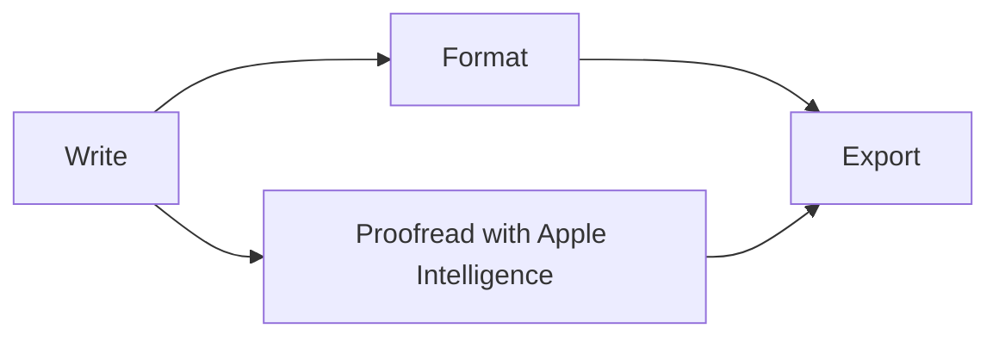

# Welcome to Markify

Markify is a Markdown editor with **one page and two lenses**. You're reading the *Rendered* lens. Press **⌘/** now to see the same text as plain Markdown, then press it again to come back.[^lens] This document is a normal `.md` file in your library, so change anything you like: it's yours to experiment with.

> [!TIP]
> Everything below works in both lenses. Try each thing as you read it.

## Write and format

Select a few words in this sentence and a **format bar** appears above them, with *italic*, ~~strikethrough~~, `code` and [links](https://spaquet.github.io/markify/). Keyboard shortcuts work too: ⌘B, ⌘I, ⇧⌘X, ⌘E and ⌘K.

Markdown also formats as you type. On an empty line, type `## ` for a heading or `- ` for a list.

Now type **/** at the start of an empty line below. The **slash menu** lists every block you can insert, each with its Markdown shortcut so you learn the syntax as you go.


## Lists and tasks

- [x] Open Markify
- [x] Read the first section
- [ ] Click this box to tick it off
- [ ] Press Return at the end of this line to add another task

1. Numbered lists count themselves.
2. Add or remove an item and the rest renumber.

## Tables

Click a cell to edit it, and press Tab to move to the next one. Tab in the last cell adds a row.

| Lens | Shows | Toggle |
| --- | --- | :---: |
| Rendered | The page as a reader sees it | ⌘/ |
| Markdown | Every character of the file | ⌘/ |

## Callouts

> [!NOTE]
> GitHub-style callouts come in four kinds.

> [!IMPORTANT]
> They're ordinary quotes that start with `[!NOTE]`, `[!TIP]`, `[!IMPORTANT]` or `[!WARNING]`.

> [!WARNING]
> So they look right on GitHub too.

## Code, math and diagrams

Fenced code gets syntax colors:

```swift
// Switch lenses without losing your place
let lens: Lens = markdown ? .source : .rendered
print("Showing the \(lens) lens")
```

Math is typeset on your Mac, inline like $E = mc^2$ or on its own line:

$$
\int_0^1 x^2\,dx = \frac{1}{3}
$$

And a `mermaid` code block becomes a diagram:



## Images and links

Drag an image onto the page or paste one, and Markify copies it into an `assets` folder next to your document:


**⌘-click** a link to open it, like this one to the [Markify website](https://spaquet.github.io/markify/). Drag a note from the library into the page to link to it.

## Your library

Press **⌃⌘S** to open the library. It lists the files you have open and the notes in your library folder. Search it by name or text.

## Apple Intelligence

On a Mac with Apple Intelligence, select a paragraph and click the multicolor symbol in the format bar to proofread, rewrite or change its tone. On an empty line, press **⌘↩** to have Markify continue your writing. Everything runs on your Mac, and nothing changes until you keep it.

## Share and export

Choose **… › Export** at the top right to save this document as a self-contained **HTML** page or a paginated **PDF**, with the math, diagrams and images included.

## Where to go next

- **Help › Markify Help** has the full guide, and **Help › Keyboard Shortcuts** the complete list.
- **Markify › Settings** (⌘,) changes the fonts, line width, theme and more.
- Open this tour again anytime from **Help › Welcome to Markify**.

Happy writing!

[^lens]: Both lenses edit the same file. Switching restyles the text; it never converts or rewrites your Markdown. Hover over this note's number to read it, or ⌘-click it to jump back.
