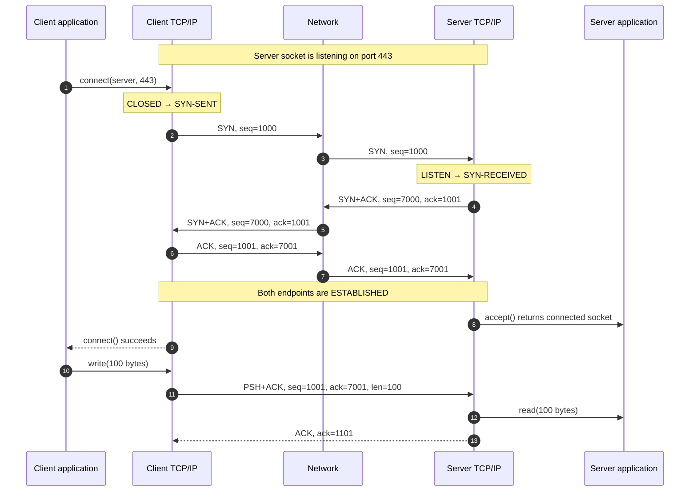
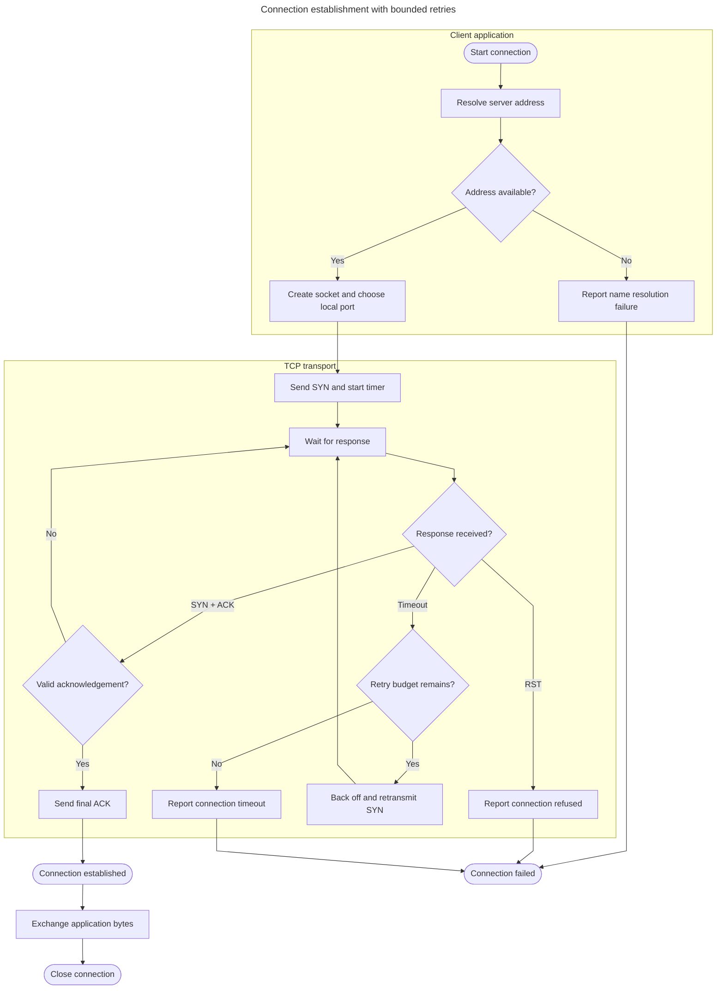
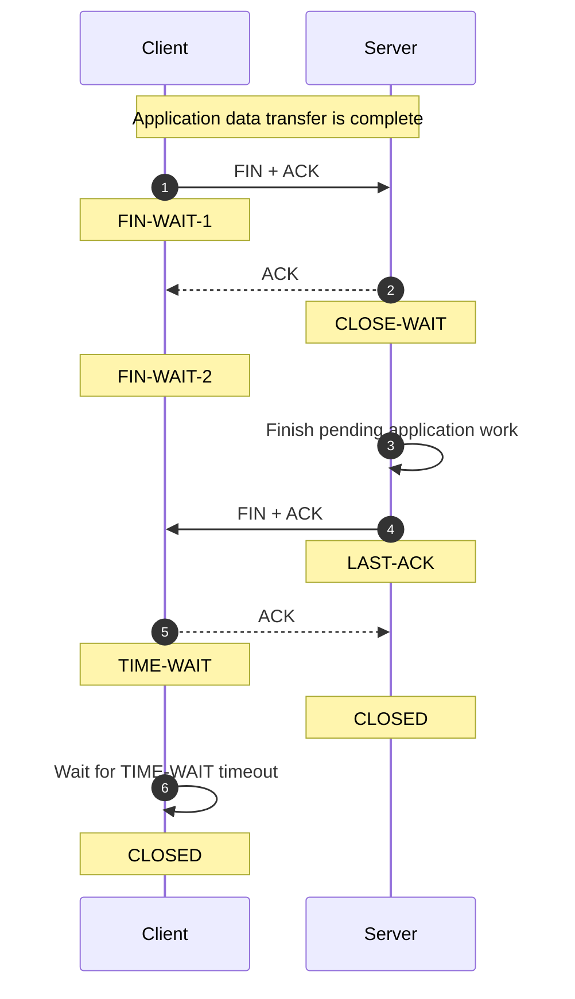
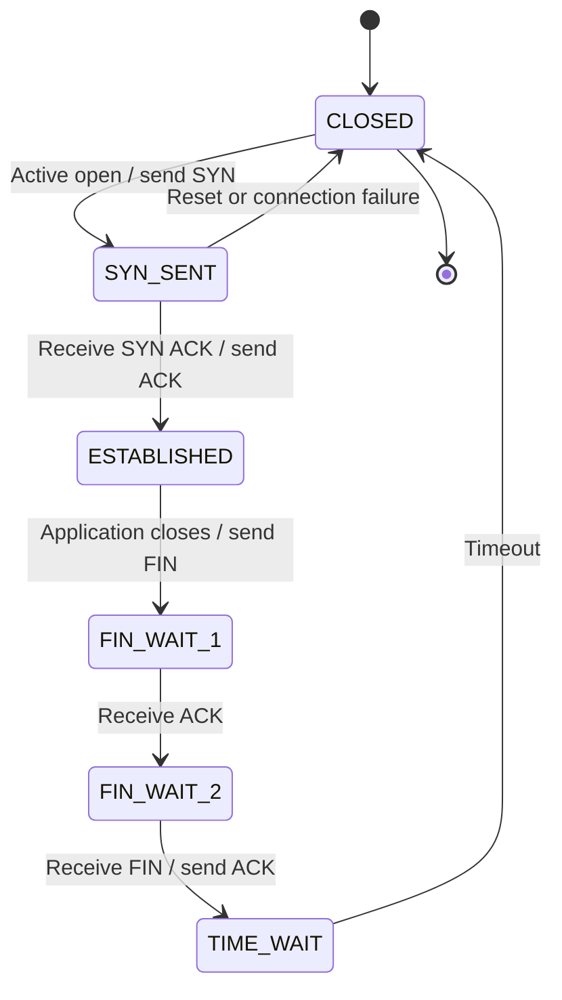
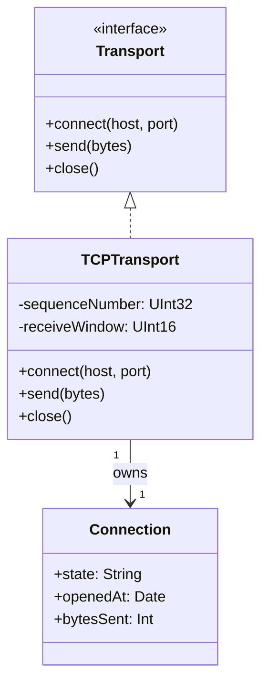
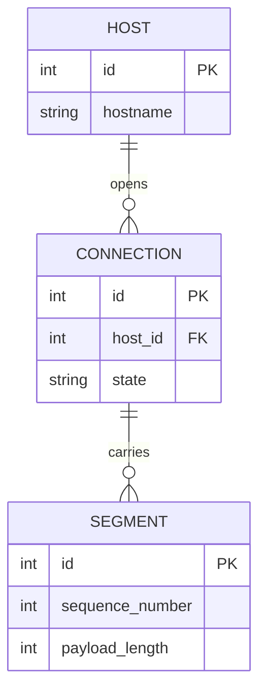
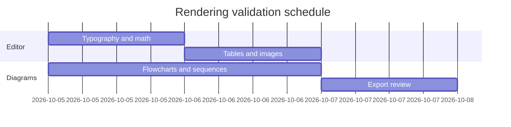
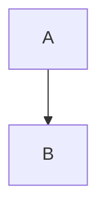
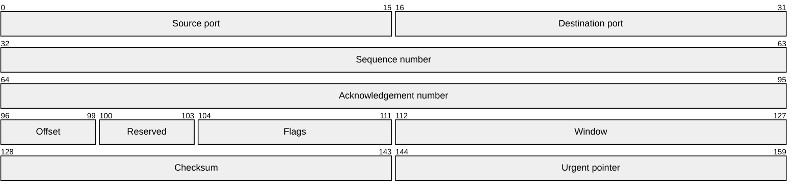

# Markify rendering stress test

A long, deliberately busy document for manually checking rendering, scrolling, table expansion, source editing, and export. All images are local repository assets, so this document works offline. TCP examples illustrate common paths; see [RFC 9293](https://www.rfc-editor.org/rfc/rfc9293.html#section-3.5) for the protocol specification.

## Manual validation checklist

- [ ] Open this file in Markify and scroll all the way to **END OF STRESS TEST**.
- [ ] Switch between Rendered and Markdown lenses with ⌘/ at the top, middle, and bottom.
- [ ] Resize the window from narrow to wide; diagrams should fit the column without clipping.
- [ ] Switch between light and dark appearance; labels and arrows should stay legible.
- [ ] Hover over long table rows, including image and Mermaid rows, to expand them.
- [ ] Edit a table cell, navigate with Tab and ⇧Tab, then undo the change.
- [ ] Edit a diagram in the Markdown lens, then return to Rendered and check the result.
- [ ] Click inline and display math to edit, then leave it to restore typesetting.
- [ ] Check the Contents outline, find `SCROLL-ANCHOR-04`, and follow a local link.
- [ ] Export HTML and PDF; check equations, diagrams, local images, and page boundaries.
- [ ] Open Finder Quick Look for this file and compare the standalone diagrams.

> [!NOTE]
> Table rows initially collapse to one line per cell. Hover over a row or edit a cell to reveal its full content. Table diagram source uses `<br>` between lines. Standalone diagrams use normal fenced blocks.

## 1. Typography, inline code, and inline math

This paragraph mixes **bold**, *italic*, ***bold italic***, ~~strikethrough~~, `inline code`, and [a local guide](help/markdown.md). The client calls `connect(host, port)` before sending bytes. The inline equation $E = mc^2$ should share the baseline with the surrounding text; so should $a^2 + b^2 = c^2$, $\alpha + \beta = \gamma$, and $\frac{1}{2}mv^2$. Literal prices such as $5 and $10 should stay text. Code such as `$not_math$` should also stay code.

Unicode and punctuation: café, naïve, résumé, Zürich, Ελληνικά, 日本語, 中文, 😀, →, ⇧⌘K, “curly quotes”, and an em dash — followed by normal Latin text. A footnote reference belongs here.[^baseline]

A long inline token tests horizontal pressure: `tcp://client.example.test:49152/server.example.test:443?connect_timeout_ms=5000&retry_policy=exponential_backoff&trace_id=0123456789abcdef`.

### Small alignment table

| ID | Left aligned | Center aligned | Right aligned |
| :---: | :--- | :---: | ---: |
| 1 | **Draft** with `code` | $x^2$ | 1,024 |
| 2 | *Review* with [guide](help/formatting.md) | $\alpha$ | 65,535 |
| 3 | ~~Discarded~~ → published | ✓ | 3.14159 |
| 004 | Escaped pipe: A \| B | A / B | -42 |

### SCROLL-ANCHOR-01

This padding section separates rendering samples and creates enough text to test scrolling and pagination.

Lorem ipsum dolor sit amet, consectetur adipiscing elit. Sed do eiusmod tempor incididunt ut labore et dolore magna aliqua. Ut enim ad minim veniam, quis nostrud exercitation ullamco laboris nisi ut aliquip ex ea commodo consequat. Duis aute irure dolor in reprehenderit in voluptate velit esse cillum dolore eu fugiat nulla pariatur. Excepteur sint occaecat cupidatat non proident, sunt in culpa qui officia deserunt mollit anim id est laborum. Integer posuere erat a ante venenatis dapibus posuere velit aliquet. Cras mattis consectetur purus sit amet fermentum. Maecenas faucibus mollis interdum. Donec ullamcorper nulla non metus auctor fringilla. Aenean lacinia bibendum nulla sed consectetur. Praesent commodo cursus magna, vel scelerisque nisl consectetur et. Vestibulum id ligula porta felis euismod semper. Curabitur blandit tempus porttitor.  Padding sample 1.1: **bold text**, *italic text*, `sample_1_1`, and $x^2 + y^2 = z^2$ should render consistently at this document position.

Integer posuere erat a ante venenatis dapibus posuere velit aliquet. Cras mattis consectetur purus sit amet fermentum. Maecenas faucibus mollis interdum. Donec ullamcorper nulla non metus auctor fringilla. Aenean lacinia bibendum nulla sed consectetur. Praesent commodo cursus magna, vel scelerisque nisl consectetur et. Vestibulum id ligula porta felis euismod semper. Curabitur blandit tempus porttitor. Nullam id dolor id nibh ultricies vehicula ut id elit. Morbi leo risus, porta ac consectetur ac, vestibulum at eros. Vivamus sagittis lacus vel augue laoreet rutrum faucibus dolor auctor. Etiam porta sem malesuada magna mollis euismod. Fusce dapibus, tellus ac cursus commodo, tortor mauris condimentum nibh, ut fermentum massa justo sit amet risus.  Padding sample 1.2: **bold text**, *italic text*, `sample_1_2`, and $x^2 + y^2 = z^2$ should render consistently at this document position.

Nullam id dolor id nibh ultricies vehicula ut id elit. Morbi leo risus, porta ac consectetur ac, vestibulum at eros. Vivamus sagittis lacus vel augue laoreet rutrum faucibus dolor auctor. Etiam porta sem malesuada magna mollis euismod. Fusce dapibus, tellus ac cursus commodo, tortor mauris condimentum nibh, ut fermentum massa justo sit amet risus. Lorem ipsum dolor sit amet, consectetur adipiscing elit. Sed do eiusmod tempor incididunt ut labore et dolore magna aliqua. Ut enim ad minim veniam, quis nostrud exercitation ullamco laboris nisi ut aliquip ex ea commodo consequat. Duis aute irure dolor in reprehenderit in voluptate velit esse cillum dolore eu fugiat nulla pariatur. Excepteur sint occaecat cupidatat non proident, sunt in culpa qui officia deserunt mollit anim id est laborum.  Padding sample 1.3: **bold text**, *italic text*, `sample_1_3`, and $x^2 + y^2 = z^2$ should render consistently at this document position.

Lorem ipsum dolor sit amet, consectetur adipiscing elit. Sed do eiusmod tempor incididunt ut labore et dolore magna aliqua. Ut enim ad minim veniam, quis nostrud exercitation ullamco laboris nisi ut aliquip ex ea commodo consequat. Duis aute irure dolor in reprehenderit in voluptate velit esse cillum dolore eu fugiat nulla pariatur. Excepteur sint occaecat cupidatat non proident, sunt in culpa qui officia deserunt mollit anim id est laborum. Integer posuere erat a ante venenatis dapibus posuere velit aliquet. Cras mattis consectetur purus sit amet fermentum. Maecenas faucibus mollis interdum. Donec ullamcorper nulla non metus auctor fringilla. Aenean lacinia bibendum nulla sed consectetur. Praesent commodo cursus magna, vel scelerisque nisl consectetur et. Vestibulum id ligula porta felis euismod semper. Curabitur blandit tempus porttitor.  Padding sample 1.4: **bold text**, *italic text*, `sample_1_4`, and $x^2 + y^2 = z^2$ should render consistently at this document position.

Integer posuere erat a ante venenatis dapibus posuere velit aliquet. Cras mattis consectetur purus sit amet fermentum. Maecenas faucibus mollis interdum. Donec ullamcorper nulla non metus auctor fringilla. Aenean lacinia bibendum nulla sed consectetur. Praesent commodo cursus magna, vel scelerisque nisl consectetur et. Vestibulum id ligula porta felis euismod semper. Curabitur blandit tempus porttitor. Nullam id dolor id nibh ultricies vehicula ut id elit. Morbi leo risus, porta ac consectetur ac, vestibulum at eros. Vivamus sagittis lacus vel augue laoreet rutrum faucibus dolor auctor. Etiam porta sem malesuada magna mollis euismod. Fusce dapibus, tellus ac cursus commodo, tortor mauris condimentum nibh, ut fermentum massa justo sit amet risus.  Padding sample 1.5: **bold text**, *italic text*, `sample_1_5`, and $x^2 + y^2 = z^2$ should render consistently at this document position.

Nullam id dolor id nibh ultricies vehicula ut id elit. Morbi leo risus, porta ac consectetur ac, vestibulum at eros. Vivamus sagittis lacus vel augue laoreet rutrum faucibus dolor auctor. Etiam porta sem malesuada magna mollis euismod. Fusce dapibus, tellus ac cursus commodo, tortor mauris condimentum nibh, ut fermentum massa justo sit amet risus. Lorem ipsum dolor sit amet, consectetur adipiscing elit. Sed do eiusmod tempor incididunt ut labore et dolore magna aliqua. Ut enim ad minim veniam, quis nostrud exercitation ullamco laboris nisi ut aliquip ex ea commodo consequat. Duis aute irure dolor in reprehenderit in voluptate velit esse cillum dolore eu fugiat nulla pariatur. Excepteur sint occaecat cupidatat non proident, sunt in culpa qui officia deserunt mollit anim id est laborum.  Padding sample 1.6: **bold text**, *italic text*, `sample_1_6`, and $x^2 + y^2 = z^2$ should render consistently at this document position.

## 2. TCP connection establishment

### Three-way handshake and first application message

In this simplified exchange the client chooses initial sequence number 1000 and the server chooses 7000. SYN consumes one sequence number. The subsequent 100-byte payload advances the client's next sequence number to 1101. TCP carries the application bytes inside IP packets.



### Connection attempt with retry and failure paths

This flowchart is an application-level simplification, with a bounded retry policy rather than a complete TCP state machine.



### Packet fields table

| ID | Direction | Flags | Sequence | Acknowledgement | Payload |
| --- | --- | --- | ---: | ---: | ---: |
| 1 | Client → Server | `SYN` | 1000 | — | 0 bytes |
| 2 | Server → Client | `SYN, ACK` | 7000 | 1001 | 0 bytes |
| 3 | Client → Server | `ACK` | 1001 | 7001 | 0 bytes |
| 4 | Client → Server | `PSH, ACK` | 1001 | 7001 | 100 bytes |
| 5 | Server → Client | `ACK` | 7001 | 1101 | 0 bytes |

### SCROLL-ANCHOR-02

This padding section separates rendering samples and creates enough text to test scrolling and pagination.

Lorem ipsum dolor sit amet, consectetur adipiscing elit. Sed do eiusmod tempor incididunt ut labore et dolore magna aliqua. Ut enim ad minim veniam, quis nostrud exercitation ullamco laboris nisi ut aliquip ex ea commodo consequat. Duis aute irure dolor in reprehenderit in voluptate velit esse cillum dolore eu fugiat nulla pariatur. Excepteur sint occaecat cupidatat non proident, sunt in culpa qui officia deserunt mollit anim id est laborum. Integer posuere erat a ante venenatis dapibus posuere velit aliquet. Cras mattis consectetur purus sit amet fermentum. Maecenas faucibus mollis interdum. Donec ullamcorper nulla non metus auctor fringilla. Aenean lacinia bibendum nulla sed consectetur. Praesent commodo cursus magna, vel scelerisque nisl consectetur et. Vestibulum id ligula porta felis euismod semper. Curabitur blandit tempus porttitor.  Padding sample 2.1: **bold text**, *italic text*, `sample_2_1`, and $x^2 + y^2 = z^2$ should render consistently at this document position.

Integer posuere erat a ante venenatis dapibus posuere velit aliquet. Cras mattis consectetur purus sit amet fermentum. Maecenas faucibus mollis interdum. Donec ullamcorper nulla non metus auctor fringilla. Aenean lacinia bibendum nulla sed consectetur. Praesent commodo cursus magna, vel scelerisque nisl consectetur et. Vestibulum id ligula porta felis euismod semper. Curabitur blandit tempus porttitor. Nullam id dolor id nibh ultricies vehicula ut id elit. Morbi leo risus, porta ac consectetur ac, vestibulum at eros. Vivamus sagittis lacus vel augue laoreet rutrum faucibus dolor auctor. Etiam porta sem malesuada magna mollis euismod. Fusce dapibus, tellus ac cursus commodo, tortor mauris condimentum nibh, ut fermentum massa justo sit amet risus.  Padding sample 2.2: **bold text**, *italic text*, `sample_2_2`, and $x^2 + y^2 = z^2$ should render consistently at this document position.

Nullam id dolor id nibh ultricies vehicula ut id elit. Morbi leo risus, porta ac consectetur ac, vestibulum at eros. Vivamus sagittis lacus vel augue laoreet rutrum faucibus dolor auctor. Etiam porta sem malesuada magna mollis euismod. Fusce dapibus, tellus ac cursus commodo, tortor mauris condimentum nibh, ut fermentum massa justo sit amet risus. Lorem ipsum dolor sit amet, consectetur adipiscing elit. Sed do eiusmod tempor incididunt ut labore et dolore magna aliqua. Ut enim ad minim veniam, quis nostrud exercitation ullamco laboris nisi ut aliquip ex ea commodo consequat. Duis aute irure dolor in reprehenderit in voluptate velit esse cillum dolore eu fugiat nulla pariatur. Excepteur sint occaecat cupidatat non proident, sunt in culpa qui officia deserunt mollit anim id est laborum.  Padding sample 2.3: **bold text**, *italic text*, `sample_2_3`, and $x^2 + y^2 = z^2$ should render consistently at this document position.

Lorem ipsum dolor sit amet, consectetur adipiscing elit. Sed do eiusmod tempor incididunt ut labore et dolore magna aliqua. Ut enim ad minim veniam, quis nostrud exercitation ullamco laboris nisi ut aliquip ex ea commodo consequat. Duis aute irure dolor in reprehenderit in voluptate velit esse cillum dolore eu fugiat nulla pariatur. Excepteur sint occaecat cupidatat non proident, sunt in culpa qui officia deserunt mollit anim id est laborum. Integer posuere erat a ante venenatis dapibus posuere velit aliquet. Cras mattis consectetur purus sit amet fermentum. Maecenas faucibus mollis interdum. Donec ullamcorper nulla non metus auctor fringilla. Aenean lacinia bibendum nulla sed consectetur. Praesent commodo cursus magna, vel scelerisque nisl consectetur et. Vestibulum id ligula porta felis euismod semper. Curabitur blandit tempus porttitor.  Padding sample 2.4: **bold text**, *italic text*, `sample_2_4`, and $x^2 + y^2 = z^2$ should render consistently at this document position.

Integer posuere erat a ante venenatis dapibus posuere velit aliquet. Cras mattis consectetur purus sit amet fermentum. Maecenas faucibus mollis interdum. Donec ullamcorper nulla non metus auctor fringilla. Aenean lacinia bibendum nulla sed consectetur. Praesent commodo cursus magna, vel scelerisque nisl consectetur et. Vestibulum id ligula porta felis euismod semper. Curabitur blandit tempus porttitor. Nullam id dolor id nibh ultricies vehicula ut id elit. Morbi leo risus, porta ac consectetur ac, vestibulum at eros. Vivamus sagittis lacus vel augue laoreet rutrum faucibus dolor auctor. Etiam porta sem malesuada magna mollis euismod. Fusce dapibus, tellus ac cursus commodo, tortor mauris condimentum nibh, ut fermentum massa justo sit amet risus.  Padding sample 2.5: **bold text**, *italic text*, `sample_2_5`, and $x^2 + y^2 = z^2$ should render consistently at this document position.

Nullam id dolor id nibh ultricies vehicula ut id elit. Morbi leo risus, porta ac consectetur ac, vestibulum at eros. Vivamus sagittis lacus vel augue laoreet rutrum faucibus dolor auctor. Etiam porta sem malesuada magna mollis euismod. Fusce dapibus, tellus ac cursus commodo, tortor mauris condimentum nibh, ut fermentum massa justo sit amet risus. Lorem ipsum dolor sit amet, consectetur adipiscing elit. Sed do eiusmod tempor incididunt ut labore et dolore magna aliqua. Ut enim ad minim veniam, quis nostrud exercitation ullamco laboris nisi ut aliquip ex ea commodo consequat. Duis aute irure dolor in reprehenderit in voluptate velit esse cillum dolore eu fugiat nulla pariatur. Excepteur sint occaecat cupidatat non proident, sunt in culpa qui officia deserunt mollit anim id est laborum.  Padding sample 2.6: **bold text**, *italic text*, `sample_2_6`, and $x^2 + y^2 = z^2$ should render consistently at this document position.

## 3. Tables with local images

The small icon, large icon, and wide screenshot exercise different source dimensions. Hover each row and make the window narrow, then wide. The text column should not cover the image column. Relative links should resolve from this document's location.

| ID | Asset | Image | Notes |
| --- | --- | --- | --- |
| 1 | Small app icon |  | **Square image.** Compare sharpness in light and dark appearance. |
| 2 | Large app icon |  | Large source scaled into a table cell; the row should expand without pushing the following row over it. |
| 3 | Table screenshot |  | Wide image; compare the full-size block below with this cell thumbnail. |
| 4 | Inline image and text | Before  after | The words on either side should remain visible when the row expands. |

### Wide standalone image


The paragraph after the image must appear below it with ordinary line spacing. This line includes an inline icon  so you can compare its hover preview with the block image above.

### SCROLL-ANCHOR-03

This padding section separates rendering samples and creates enough text to test scrolling and pagination.

Lorem ipsum dolor sit amet, consectetur adipiscing elit. Sed do eiusmod tempor incididunt ut labore et dolore magna aliqua. Ut enim ad minim veniam, quis nostrud exercitation ullamco laboris nisi ut aliquip ex ea commodo consequat. Duis aute irure dolor in reprehenderit in voluptate velit esse cillum dolore eu fugiat nulla pariatur. Excepteur sint occaecat cupidatat non proident, sunt in culpa qui officia deserunt mollit anim id est laborum. Integer posuere erat a ante venenatis dapibus posuere velit aliquet. Cras mattis consectetur purus sit amet fermentum. Maecenas faucibus mollis interdum. Donec ullamcorper nulla non metus auctor fringilla. Aenean lacinia bibendum nulla sed consectetur. Praesent commodo cursus magna, vel scelerisque nisl consectetur et. Vestibulum id ligula porta felis euismod semper. Curabitur blandit tempus porttitor.  Padding sample 3.1: **bold text**, *italic text*, `sample_3_1`, and $x^2 + y^2 = z^2$ should render consistently at this document position.

Integer posuere erat a ante venenatis dapibus posuere velit aliquet. Cras mattis consectetur purus sit amet fermentum. Maecenas faucibus mollis interdum. Donec ullamcorper nulla non metus auctor fringilla. Aenean lacinia bibendum nulla sed consectetur. Praesent commodo cursus magna, vel scelerisque nisl consectetur et. Vestibulum id ligula porta felis euismod semper. Curabitur blandit tempus porttitor. Nullam id dolor id nibh ultricies vehicula ut id elit. Morbi leo risus, porta ac consectetur ac, vestibulum at eros. Vivamus sagittis lacus vel augue laoreet rutrum faucibus dolor auctor. Etiam porta sem malesuada magna mollis euismod. Fusce dapibus, tellus ac cursus commodo, tortor mauris condimentum nibh, ut fermentum massa justo sit amet risus.  Padding sample 3.2: **bold text**, *italic text*, `sample_3_2`, and $x^2 + y^2 = z^2$ should render consistently at this document position.

Nullam id dolor id nibh ultricies vehicula ut id elit. Morbi leo risus, porta ac consectetur ac, vestibulum at eros. Vivamus sagittis lacus vel augue laoreet rutrum faucibus dolor auctor. Etiam porta sem malesuada magna mollis euismod. Fusce dapibus, tellus ac cursus commodo, tortor mauris condimentum nibh, ut fermentum massa justo sit amet risus. Lorem ipsum dolor sit amet, consectetur adipiscing elit. Sed do eiusmod tempor incididunt ut labore et dolore magna aliqua. Ut enim ad minim veniam, quis nostrud exercitation ullamco laboris nisi ut aliquip ex ea commodo consequat. Duis aute irure dolor in reprehenderit in voluptate velit esse cillum dolore eu fugiat nulla pariatur. Excepteur sint occaecat cupidatat non proident, sunt in culpa qui officia deserunt mollit anim id est laborum.  Padding sample 3.3: **bold text**, *italic text*, `sample_3_3`, and $x^2 + y^2 = z^2$ should render consistently at this document position.

Lorem ipsum dolor sit amet, consectetur adipiscing elit. Sed do eiusmod tempor incididunt ut labore et dolore magna aliqua. Ut enim ad minim veniam, quis nostrud exercitation ullamco laboris nisi ut aliquip ex ea commodo consequat. Duis aute irure dolor in reprehenderit in voluptate velit esse cillum dolore eu fugiat nulla pariatur. Excepteur sint occaecat cupidatat non proident, sunt in culpa qui officia deserunt mollit anim id est laborum. Integer posuere erat a ante venenatis dapibus posuere velit aliquet. Cras mattis consectetur purus sit amet fermentum. Maecenas faucibus mollis interdum. Donec ullamcorper nulla non metus auctor fringilla. Aenean lacinia bibendum nulla sed consectetur. Praesent commodo cursus magna, vel scelerisque nisl consectetur et. Vestibulum id ligula porta felis euismod semper. Curabitur blandit tempus porttitor.  Padding sample 3.4: **bold text**, *italic text*, `sample_3_4`, and $x^2 + y^2 = z^2$ should render consistently at this document position.

Integer posuere erat a ante venenatis dapibus posuere velit aliquet. Cras mattis consectetur purus sit amet fermentum. Maecenas faucibus mollis interdum. Donec ullamcorper nulla non metus auctor fringilla. Aenean lacinia bibendum nulla sed consectetur. Praesent commodo cursus magna, vel scelerisque nisl consectetur et. Vestibulum id ligula porta felis euismod semper. Curabitur blandit tempus porttitor. Nullam id dolor id nibh ultricies vehicula ut id elit. Morbi leo risus, porta ac consectetur ac, vestibulum at eros. Vivamus sagittis lacus vel augue laoreet rutrum faucibus dolor auctor. Etiam porta sem malesuada magna mollis euismod. Fusce dapibus, tellus ac cursus commodo, tortor mauris condimentum nibh, ut fermentum massa justo sit amet risus.  Padding sample 3.5: **bold text**, *italic text*, `sample_3_5`, and $x^2 + y^2 = z^2$ should render consistently at this document position.

Nullam id dolor id nibh ultricies vehicula ut id elit. Morbi leo risus, porta ac consectetur ac, vestibulum at eros. Vivamus sagittis lacus vel augue laoreet rutrum faucibus dolor auctor. Etiam porta sem malesuada magna mollis euismod. Fusce dapibus, tellus ac cursus commodo, tortor mauris condimentum nibh, ut fermentum massa justo sit amet risus. Lorem ipsum dolor sit amet, consectetur adipiscing elit. Sed do eiusmod tempor incididunt ut labore et dolore magna aliqua. Ut enim ad minim veniam, quis nostrud exercitation ullamco laboris nisi ut aliquip ex ea commodo consequat. Duis aute irure dolor in reprehenderit in voluptate velit esse cillum dolore eu fugiat nulla pariatur. Excepteur sint occaecat cupidatat non proident, sunt in culpa qui officia deserunt mollit anim id est laborum.  Padding sample 3.6: **bold text**, *italic text*, `sample_3_6`, and $x^2 + y^2 = z^2$ should render consistently at this document position.

## 4. Tables with Mermaid diagrams and mixed content

Each diagram is written on one source line with `<br>` separators. Click a cell to inspect its original Markdown. The diagrams in this table intentionally use compact shapes and short labels, while the standalone TCP examples are larger.

| ID | Scenario | Rendered diagram | Expected result |
| --- | --- | --- | --- |
| 1 | Handshake flow | ```mermaid<br>flowchart TD<br>A[Send SYN] --> B[Receive SYN ACK]<br>B --> C[Send ACK]<br>C --> D[Established]<br>``` | Four nodes in a vertical flow. Hover to reveal all nodes. |
| 2 | Handshake sequence | ```mermaid<br>sequenceDiagram<br>participant C as Client<br>participant S as Server<br>C->>S: SYN<br>S-->>C: SYN ACK<br>C->>S: ACK<br>``` | Two participants and three messages. |
| 3 | Small state machine | ```mermaid<br>stateDiagram-v2<br>[*] --> Draft<br>Draft --> Review<br>Review --> Published<br>Published --> [*]<br>``` | Start and finish markers with three named states. |

### Mixed content and multiline cells

| ID | Text and code | Math | Image |
| --- | --- | --- | --- |
| 10 | **Connection budget**<br>Call `connect()`<br>Then inspect `errno` | $t_{total} = t_{dns} + t_{tcp}$ |  |
| 11 | *Window size*<br>Long explanatory text in a multiline cell tests row expansion and source-preserving edits.<br>[Formatting guide](help/formatting.md) | $W = 64 \times 1024$ |  |
| 12 | Literal pipe: `left \| right`<br>Escaped pipe: left \| right | $\sqrt{x^2+y^2}$ | Plain text after image:  |

### SCROLL-ANCHOR-04

This padding section separates rendering samples and creates enough text to test scrolling and pagination.

Lorem ipsum dolor sit amet, consectetur adipiscing elit. Sed do eiusmod tempor incididunt ut labore et dolore magna aliqua. Ut enim ad minim veniam, quis nostrud exercitation ullamco laboris nisi ut aliquip ex ea commodo consequat. Duis aute irure dolor in reprehenderit in voluptate velit esse cillum dolore eu fugiat nulla pariatur. Excepteur sint occaecat cupidatat non proident, sunt in culpa qui officia deserunt mollit anim id est laborum. Integer posuere erat a ante venenatis dapibus posuere velit aliquet. Cras mattis consectetur purus sit amet fermentum. Maecenas faucibus mollis interdum. Donec ullamcorper nulla non metus auctor fringilla. Aenean lacinia bibendum nulla sed consectetur. Praesent commodo cursus magna, vel scelerisque nisl consectetur et. Vestibulum id ligula porta felis euismod semper. Curabitur blandit tempus porttitor.  Padding sample 4.1: **bold text**, *italic text*, `sample_4_1`, and $x^2 + y^2 = z^2$ should render consistently at this document position.

Integer posuere erat a ante venenatis dapibus posuere velit aliquet. Cras mattis consectetur purus sit amet fermentum. Maecenas faucibus mollis interdum. Donec ullamcorper nulla non metus auctor fringilla. Aenean lacinia bibendum nulla sed consectetur. Praesent commodo cursus magna, vel scelerisque nisl consectetur et. Vestibulum id ligula porta felis euismod semper. Curabitur blandit tempus porttitor. Nullam id dolor id nibh ultricies vehicula ut id elit. Morbi leo risus, porta ac consectetur ac, vestibulum at eros. Vivamus sagittis lacus vel augue laoreet rutrum faucibus dolor auctor. Etiam porta sem malesuada magna mollis euismod. Fusce dapibus, tellus ac cursus commodo, tortor mauris condimentum nibh, ut fermentum massa justo sit amet risus.  Padding sample 4.2: **bold text**, *italic text*, `sample_4_2`, and $x^2 + y^2 = z^2$ should render consistently at this document position.

Nullam id dolor id nibh ultricies vehicula ut id elit. Morbi leo risus, porta ac consectetur ac, vestibulum at eros. Vivamus sagittis lacus vel augue laoreet rutrum faucibus dolor auctor. Etiam porta sem malesuada magna mollis euismod. Fusce dapibus, tellus ac cursus commodo, tortor mauris condimentum nibh, ut fermentum massa justo sit amet risus. Lorem ipsum dolor sit amet, consectetur adipiscing elit. Sed do eiusmod tempor incididunt ut labore et dolore magna aliqua. Ut enim ad minim veniam, quis nostrud exercitation ullamco laboris nisi ut aliquip ex ea commodo consequat. Duis aute irure dolor in reprehenderit in voluptate velit esse cillum dolore eu fugiat nulla pariatur. Excepteur sint occaecat cupidatat non proident, sunt in culpa qui officia deserunt mollit anim id est laborum.  Padding sample 4.3: **bold text**, *italic text*, `sample_4_3`, and $x^2 + y^2 = z^2$ should render consistently at this document position.

Lorem ipsum dolor sit amet, consectetur adipiscing elit. Sed do eiusmod tempor incididunt ut labore et dolore magna aliqua. Ut enim ad minim veniam, quis nostrud exercitation ullamco laboris nisi ut aliquip ex ea commodo consequat. Duis aute irure dolor in reprehenderit in voluptate velit esse cillum dolore eu fugiat nulla pariatur. Excepteur sint occaecat cupidatat non proident, sunt in culpa qui officia deserunt mollit anim id est laborum. Integer posuere erat a ante venenatis dapibus posuere velit aliquet. Cras mattis consectetur purus sit amet fermentum. Maecenas faucibus mollis interdum. Donec ullamcorper nulla non metus auctor fringilla. Aenean lacinia bibendum nulla sed consectetur. Praesent commodo cursus magna, vel scelerisque nisl consectetur et. Vestibulum id ligula porta felis euismod semper. Curabitur blandit tempus porttitor.  Padding sample 4.4: **bold text**, *italic text*, `sample_4_4`, and $x^2 + y^2 = z^2$ should render consistently at this document position.

Integer posuere erat a ante venenatis dapibus posuere velit aliquet. Cras mattis consectetur purus sit amet fermentum. Maecenas faucibus mollis interdum. Donec ullamcorper nulla non metus auctor fringilla. Aenean lacinia bibendum nulla sed consectetur. Praesent commodo cursus magna, vel scelerisque nisl consectetur et. Vestibulum id ligula porta felis euismod semper. Curabitur blandit tempus porttitor. Nullam id dolor id nibh ultricies vehicula ut id elit. Morbi leo risus, porta ac consectetur ac, vestibulum at eros. Vivamus sagittis lacus vel augue laoreet rutrum faucibus dolor auctor. Etiam porta sem malesuada magna mollis euismod. Fusce dapibus, tellus ac cursus commodo, tortor mauris condimentum nibh, ut fermentum massa justo sit amet risus.  Padding sample 4.5: **bold text**, *italic text*, `sample_4_5`, and $x^2 + y^2 = z^2$ should render consistently at this document position.

Nullam id dolor id nibh ultricies vehicula ut id elit. Morbi leo risus, porta ac consectetur ac, vestibulum at eros. Vivamus sagittis lacus vel augue laoreet rutrum faucibus dolor auctor. Etiam porta sem malesuada magna mollis euismod. Fusce dapibus, tellus ac cursus commodo, tortor mauris condimentum nibh, ut fermentum massa justo sit amet risus. Lorem ipsum dolor sit amet, consectetur adipiscing elit. Sed do eiusmod tempor incididunt ut labore et dolore magna aliqua. Ut enim ad minim veniam, quis nostrud exercitation ullamco laboris nisi ut aliquip ex ea commodo consequat. Duis aute irure dolor in reprehenderit in voluptate velit esse cillum dolore eu fugiat nulla pariatur. Excepteur sint occaecat cupidatat non proident, sunt in culpa qui officia deserunt mollit anim id est laborum.  Padding sample 4.6: **bold text**, *italic text*, `sample_4_6`, and $x^2 + y^2 = z^2$ should render consistently at this document position.

## 5. Display LaTeX and equations in prose

A sentence before the equation establishes the normal body baseline. The Gaussian integral should show superscripts, an integral, infinity, and a square root.

$$
\int_{-\infty}^{\infty} e^{-x^2}\,dx = \sqrt{\pi}
$$

A sentence after the equation should have the same body font and spacing as the sentence before it. In this illustrative timing model, $R$ is an observed round-trip delay and $\sigma$ is a variability estimate.

$$
T = R + 4\sigma
$$

### Matrix, vector, and fractions

$$
\begin{bmatrix}
1 & 2 & 3 \\
4 & 5 & 6 \\
7 & 8 & 9
\end{bmatrix}
\begin{bmatrix}
x \\ y \\ z
\end{bmatrix}
=
\begin{bmatrix}
x + 2y + 3z \\
4x + 5y + 6z \\
7x + 8y + 9z
\end{bmatrix}
$$

$$
f(x) = \frac{1}{\sqrt{2\pi\sigma^2}}\exp\left(-\frac{(x-\mu)^2}{2\sigma^2}\right)
$$

### Equations table

| ID | Name | Inline equation | Description |
| --- | --- | --- | --- |
| 1 | Energy | $E = mc^2$ | Superscript and adjacent letters. |
| 2 | Distance | $d = \sqrt{x^2+y^2}$ | Root and multiple powers. |
| 3 | Sum | $S = \sum_{i=1}^{n} i$ | Summation with lower and upper limits. |
| 4 | Fraction | $r = \frac{a+b}{c+d}$ | Numerator and denominator wider than one character. |
| 5 | Greek | $\alpha\beta + \gamma\delta$ | Several Greek glyphs beside ordinary prose. |

> [!TIP]
> Try editing a variable inside an equation, then undo. The Markdown source should retain its original delimiters and backslashes.

### SCROLL-ANCHOR-05

This padding section separates rendering samples and creates enough text to test scrolling and pagination.

Lorem ipsum dolor sit amet, consectetur adipiscing elit. Sed do eiusmod tempor incididunt ut labore et dolore magna aliqua. Ut enim ad minim veniam, quis nostrud exercitation ullamco laboris nisi ut aliquip ex ea commodo consequat. Duis aute irure dolor in reprehenderit in voluptate velit esse cillum dolore eu fugiat nulla pariatur. Excepteur sint occaecat cupidatat non proident, sunt in culpa qui officia deserunt mollit anim id est laborum. Integer posuere erat a ante venenatis dapibus posuere velit aliquet. Cras mattis consectetur purus sit amet fermentum. Maecenas faucibus mollis interdum. Donec ullamcorper nulla non metus auctor fringilla. Aenean lacinia bibendum nulla sed consectetur. Praesent commodo cursus magna, vel scelerisque nisl consectetur et. Vestibulum id ligula porta felis euismod semper. Curabitur blandit tempus porttitor.  Padding sample 5.1: **bold text**, *italic text*, `sample_5_1`, and $x^2 + y^2 = z^2$ should render consistently at this document position.

Integer posuere erat a ante venenatis dapibus posuere velit aliquet. Cras mattis consectetur purus sit amet fermentum. Maecenas faucibus mollis interdum. Donec ullamcorper nulla non metus auctor fringilla. Aenean lacinia bibendum nulla sed consectetur. Praesent commodo cursus magna, vel scelerisque nisl consectetur et. Vestibulum id ligula porta felis euismod semper. Curabitur blandit tempus porttitor. Nullam id dolor id nibh ultricies vehicula ut id elit. Morbi leo risus, porta ac consectetur ac, vestibulum at eros. Vivamus sagittis lacus vel augue laoreet rutrum faucibus dolor auctor. Etiam porta sem malesuada magna mollis euismod. Fusce dapibus, tellus ac cursus commodo, tortor mauris condimentum nibh, ut fermentum massa justo sit amet risus.  Padding sample 5.2: **bold text**, *italic text*, `sample_5_2`, and $x^2 + y^2 = z^2$ should render consistently at this document position.

Nullam id dolor id nibh ultricies vehicula ut id elit. Morbi leo risus, porta ac consectetur ac, vestibulum at eros. Vivamus sagittis lacus vel augue laoreet rutrum faucibus dolor auctor. Etiam porta sem malesuada magna mollis euismod. Fusce dapibus, tellus ac cursus commodo, tortor mauris condimentum nibh, ut fermentum massa justo sit amet risus. Lorem ipsum dolor sit amet, consectetur adipiscing elit. Sed do eiusmod tempor incididunt ut labore et dolore magna aliqua. Ut enim ad minim veniam, quis nostrud exercitation ullamco laboris nisi ut aliquip ex ea commodo consequat. Duis aute irure dolor in reprehenderit in voluptate velit esse cillum dolore eu fugiat nulla pariatur. Excepteur sint occaecat cupidatat non proident, sunt in culpa qui officia deserunt mollit anim id est laborum.  Padding sample 5.3: **bold text**, *italic text*, `sample_5_3`, and $x^2 + y^2 = z^2$ should render consistently at this document position.

Lorem ipsum dolor sit amet, consectetur adipiscing elit. Sed do eiusmod tempor incididunt ut labore et dolore magna aliqua. Ut enim ad minim veniam, quis nostrud exercitation ullamco laboris nisi ut aliquip ex ea commodo consequat. Duis aute irure dolor in reprehenderit in voluptate velit esse cillum dolore eu fugiat nulla pariatur. Excepteur sint occaecat cupidatat non proident, sunt in culpa qui officia deserunt mollit anim id est laborum. Integer posuere erat a ante venenatis dapibus posuere velit aliquet. Cras mattis consectetur purus sit amet fermentum. Maecenas faucibus mollis interdum. Donec ullamcorper nulla non metus auctor fringilla. Aenean lacinia bibendum nulla sed consectetur. Praesent commodo cursus magna, vel scelerisque nisl consectetur et. Vestibulum id ligula porta felis euismod semper. Curabitur blandit tempus porttitor.  Padding sample 5.4: **bold text**, *italic text*, `sample_5_4`, and $x^2 + y^2 = z^2$ should render consistently at this document position.

Integer posuere erat a ante venenatis dapibus posuere velit aliquet. Cras mattis consectetur purus sit amet fermentum. Maecenas faucibus mollis interdum. Donec ullamcorper nulla non metus auctor fringilla. Aenean lacinia bibendum nulla sed consectetur. Praesent commodo cursus magna, vel scelerisque nisl consectetur et. Vestibulum id ligula porta felis euismod semper. Curabitur blandit tempus porttitor. Nullam id dolor id nibh ultricies vehicula ut id elit. Morbi leo risus, porta ac consectetur ac, vestibulum at eros. Vivamus sagittis lacus vel augue laoreet rutrum faucibus dolor auctor. Etiam porta sem malesuada magna mollis euismod. Fusce dapibus, tellus ac cursus commodo, tortor mauris condimentum nibh, ut fermentum massa justo sit amet risus.  Padding sample 5.5: **bold text**, *italic text*, `sample_5_5`, and $x^2 + y^2 = z^2$ should render consistently at this document position.

Nullam id dolor id nibh ultricies vehicula ut id elit. Morbi leo risus, porta ac consectetur ac, vestibulum at eros. Vivamus sagittis lacus vel augue laoreet rutrum faucibus dolor auctor. Etiam porta sem malesuada magna mollis euismod. Fusce dapibus, tellus ac cursus commodo, tortor mauris condimentum nibh, ut fermentum massa justo sit amet risus. Lorem ipsum dolor sit amet, consectetur adipiscing elit. Sed do eiusmod tempor incididunt ut labore et dolore magna aliqua. Ut enim ad minim veniam, quis nostrud exercitation ullamco laboris nisi ut aliquip ex ea commodo consequat. Duis aute irure dolor in reprehenderit in voluptate velit esse cillum dolore eu fugiat nulla pariatur. Excepteur sint occaecat cupidatat non proident, sunt in culpa qui officia deserunt mollit anim id est laborum.  Padding sample 5.6: **bold text**, *italic text*, `sample_5_6`, and $x^2 + y^2 = z^2$ should render consistently at this document position.

## 6. Code blocks and long lines

### Swift

```swift
import Foundation

struct ConnectionAttempt {
    let host: String
    let port: UInt16
    var retryCount = 0

    var description: String {
        "Connecting to \(host):\(port), attempt \(retryCount + 1)"
    }
}

let attempt = ConnectionAttempt(host: "server.example.test", port: 443)
print(attempt.description)
// Literal Markdown stays code: **bold**, $x^2$, and ```mermaid.
```

### Python

```python
from dataclasses import dataclass

@dataclass
class Segment:
    sequence: int
    acknowledgement: int
    flags: tuple[str, ...]
    payload: bytes = b""

segments = [
    Segment(1000, 0, ("SYN",)),
    Segment(7000, 1001, ("SYN", "ACK")),
    Segment(1001, 7001, ("ACK",)),
]

for segment in segments:
    print(f"seq={segment.sequence:5d} ack={segment.acknowledgement:5d} flags={segment.flags}")
```

### JSON and an intentionally long string

```json
{
  "host": "server.example.test",
  "port": 443,
  "retry": { "attempts": 3, "backoff_ms": [250, 500, 1000] },
  "trace": "0123456789abcdef0123456789abcdef0123456789abcdef0123456789abcdef0123456789abcdef0123456789abcdef0123456789abcdef0123456789abcdef",
  "labels": ["café", "日本語", "render-test"],
  "literal_markdown": "**bold** and $x^2$ stay literal inside code"
}
```

### Shell syntax sample

```bash
# Display only: this document does not execute commands.
HOST_NAME="server.example.test"
printf 'Connecting to %s\n' "$HOST_NAME"
for attempt in 1 2 3; do
    printf 'Attempt %s: SYN -> SYN+ACK -> ACK\n' "$attempt"
done
```

### Unlabeled code

```
CLIENT                         SERVER
  | ---------- SYN ----------> |
  | <------- SYN + ACK ------- |
  | ---------- ACK ----------> |
  |                            |
  +------- ESTABLISHED --------+
```

### SCROLL-ANCHOR-06

This padding section separates rendering samples and creates enough text to test scrolling and pagination.

Lorem ipsum dolor sit amet, consectetur adipiscing elit. Sed do eiusmod tempor incididunt ut labore et dolore magna aliqua. Ut enim ad minim veniam, quis nostrud exercitation ullamco laboris nisi ut aliquip ex ea commodo consequat. Duis aute irure dolor in reprehenderit in voluptate velit esse cillum dolore eu fugiat nulla pariatur. Excepteur sint occaecat cupidatat non proident, sunt in culpa qui officia deserunt mollit anim id est laborum. Integer posuere erat a ante venenatis dapibus posuere velit aliquet. Cras mattis consectetur purus sit amet fermentum. Maecenas faucibus mollis interdum. Donec ullamcorper nulla non metus auctor fringilla. Aenean lacinia bibendum nulla sed consectetur. Praesent commodo cursus magna, vel scelerisque nisl consectetur et. Vestibulum id ligula porta felis euismod semper. Curabitur blandit tempus porttitor.  Padding sample 6.1: **bold text**, *italic text*, `sample_6_1`, and $x^2 + y^2 = z^2$ should render consistently at this document position.

Integer posuere erat a ante venenatis dapibus posuere velit aliquet. Cras mattis consectetur purus sit amet fermentum. Maecenas faucibus mollis interdum. Donec ullamcorper nulla non metus auctor fringilla. Aenean lacinia bibendum nulla sed consectetur. Praesent commodo cursus magna, vel scelerisque nisl consectetur et. Vestibulum id ligula porta felis euismod semper. Curabitur blandit tempus porttitor. Nullam id dolor id nibh ultricies vehicula ut id elit. Morbi leo risus, porta ac consectetur ac, vestibulum at eros. Vivamus sagittis lacus vel augue laoreet rutrum faucibus dolor auctor. Etiam porta sem malesuada magna mollis euismod. Fusce dapibus, tellus ac cursus commodo, tortor mauris condimentum nibh, ut fermentum massa justo sit amet risus.  Padding sample 6.2: **bold text**, *italic text*, `sample_6_2`, and $x^2 + y^2 = z^2$ should render consistently at this document position.

Nullam id dolor id nibh ultricies vehicula ut id elit. Morbi leo risus, porta ac consectetur ac, vestibulum at eros. Vivamus sagittis lacus vel augue laoreet rutrum faucibus dolor auctor. Etiam porta sem malesuada magna mollis euismod. Fusce dapibus, tellus ac cursus commodo, tortor mauris condimentum nibh, ut fermentum massa justo sit amet risus. Lorem ipsum dolor sit amet, consectetur adipiscing elit. Sed do eiusmod tempor incididunt ut labore et dolore magna aliqua. Ut enim ad minim veniam, quis nostrud exercitation ullamco laboris nisi ut aliquip ex ea commodo consequat. Duis aute irure dolor in reprehenderit in voluptate velit esse cillum dolore eu fugiat nulla pariatur. Excepteur sint occaecat cupidatat non proident, sunt in culpa qui officia deserunt mollit anim id est laborum.  Padding sample 6.3: **bold text**, *italic text*, `sample_6_3`, and $x^2 + y^2 = z^2$ should render consistently at this document position.

Lorem ipsum dolor sit amet, consectetur adipiscing elit. Sed do eiusmod tempor incididunt ut labore et dolore magna aliqua. Ut enim ad minim veniam, quis nostrud exercitation ullamco laboris nisi ut aliquip ex ea commodo consequat. Duis aute irure dolor in reprehenderit in voluptate velit esse cillum dolore eu fugiat nulla pariatur. Excepteur sint occaecat cupidatat non proident, sunt in culpa qui officia deserunt mollit anim id est laborum. Integer posuere erat a ante venenatis dapibus posuere velit aliquet. Cras mattis consectetur purus sit amet fermentum. Maecenas faucibus mollis interdum. Donec ullamcorper nulla non metus auctor fringilla. Aenean lacinia bibendum nulla sed consectetur. Praesent commodo cursus magna, vel scelerisque nisl consectetur et. Vestibulum id ligula porta felis euismod semper. Curabitur blandit tempus porttitor.  Padding sample 6.4: **bold text**, *italic text*, `sample_6_4`, and $x^2 + y^2 = z^2$ should render consistently at this document position.

Integer posuere erat a ante venenatis dapibus posuere velit aliquet. Cras mattis consectetur purus sit amet fermentum. Maecenas faucibus mollis interdum. Donec ullamcorper nulla non metus auctor fringilla. Aenean lacinia bibendum nulla sed consectetur. Praesent commodo cursus magna, vel scelerisque nisl consectetur et. Vestibulum id ligula porta felis euismod semper. Curabitur blandit tempus porttitor. Nullam id dolor id nibh ultricies vehicula ut id elit. Morbi leo risus, porta ac consectetur ac, vestibulum at eros. Vivamus sagittis lacus vel augue laoreet rutrum faucibus dolor auctor. Etiam porta sem malesuada magna mollis euismod. Fusce dapibus, tellus ac cursus commodo, tortor mauris condimentum nibh, ut fermentum massa justo sit amet risus.  Padding sample 6.5: **bold text**, *italic text*, `sample_6_5`, and $x^2 + y^2 = z^2$ should render consistently at this document position.

Nullam id dolor id nibh ultricies vehicula ut id elit. Morbi leo risus, porta ac consectetur ac, vestibulum at eros. Vivamus sagittis lacus vel augue laoreet rutrum faucibus dolor auctor. Etiam porta sem malesuada magna mollis euismod. Fusce dapibus, tellus ac cursus commodo, tortor mauris condimentum nibh, ut fermentum massa justo sit amet risus. Lorem ipsum dolor sit amet, consectetur adipiscing elit. Sed do eiusmod tempor incididunt ut labore et dolore magna aliqua. Ut enim ad minim veniam, quis nostrud exercitation ullamco laboris nisi ut aliquip ex ea commodo consequat. Duis aute irure dolor in reprehenderit in voluptate velit esse cillum dolore eu fugiat nulla pariatur. Excepteur sint occaecat cupidatat non proident, sunt in culpa qui officia deserunt mollit anim id est laborum.  Padding sample 6.6: **bold text**, *italic text*, `sample_6_6`, and $x^2 + y^2 = z^2$ should render consistently at this document position.

## 7. Closing a connection and additional diagram types

### Orderly connection close

This example uses separate acknowledgements for each FIN. Other valid exchanges can combine flags in fewer segments.



### Simplified client state diagram



### Class diagram with methods and inheritance



### Entity relationships



### Release timeline



### Small diagram before a wider packet diagram

These two blocks exercise the snapshot sizing regression: the packet diagram should not inherit the tiny graph's width.





### SCROLL-ANCHOR-07

This padding section separates rendering samples and creates enough text to test scrolling and pagination.

Lorem ipsum dolor sit amet, consectetur adipiscing elit. Sed do eiusmod tempor incididunt ut labore et dolore magna aliqua. Ut enim ad minim veniam, quis nostrud exercitation ullamco laboris nisi ut aliquip ex ea commodo consequat. Duis aute irure dolor in reprehenderit in voluptate velit esse cillum dolore eu fugiat nulla pariatur. Excepteur sint occaecat cupidatat non proident, sunt in culpa qui officia deserunt mollit anim id est laborum. Integer posuere erat a ante venenatis dapibus posuere velit aliquet. Cras mattis consectetur purus sit amet fermentum. Maecenas faucibus mollis interdum. Donec ullamcorper nulla non metus auctor fringilla. Aenean lacinia bibendum nulla sed consectetur. Praesent commodo cursus magna, vel scelerisque nisl consectetur et. Vestibulum id ligula porta felis euismod semper. Curabitur blandit tempus porttitor.  Padding sample 7.1: **bold text**, *italic text*, `sample_7_1`, and $x^2 + y^2 = z^2$ should render consistently at this document position.

Integer posuere erat a ante venenatis dapibus posuere velit aliquet. Cras mattis consectetur purus sit amet fermentum. Maecenas faucibus mollis interdum. Donec ullamcorper nulla non metus auctor fringilla. Aenean lacinia bibendum nulla sed consectetur. Praesent commodo cursus magna, vel scelerisque nisl consectetur et. Vestibulum id ligula porta felis euismod semper. Curabitur blandit tempus porttitor. Nullam id dolor id nibh ultricies vehicula ut id elit. Morbi leo risus, porta ac consectetur ac, vestibulum at eros. Vivamus sagittis lacus vel augue laoreet rutrum faucibus dolor auctor. Etiam porta sem malesuada magna mollis euismod. Fusce dapibus, tellus ac cursus commodo, tortor mauris condimentum nibh, ut fermentum massa justo sit amet risus.  Padding sample 7.2: **bold text**, *italic text*, `sample_7_2`, and $x^2 + y^2 = z^2$ should render consistently at this document position.

Nullam id dolor id nibh ultricies vehicula ut id elit. Morbi leo risus, porta ac consectetur ac, vestibulum at eros. Vivamus sagittis lacus vel augue laoreet rutrum faucibus dolor auctor. Etiam porta sem malesuada magna mollis euismod. Fusce dapibus, tellus ac cursus commodo, tortor mauris condimentum nibh, ut fermentum massa justo sit amet risus. Lorem ipsum dolor sit amet, consectetur adipiscing elit. Sed do eiusmod tempor incididunt ut labore et dolore magna aliqua. Ut enim ad minim veniam, quis nostrud exercitation ullamco laboris nisi ut aliquip ex ea commodo consequat. Duis aute irure dolor in reprehenderit in voluptate velit esse cillum dolore eu fugiat nulla pariatur. Excepteur sint occaecat cupidatat non proident, sunt in culpa qui officia deserunt mollit anim id est laborum.  Padding sample 7.3: **bold text**, *italic text*, `sample_7_3`, and $x^2 + y^2 = z^2$ should render consistently at this document position.

Lorem ipsum dolor sit amet, consectetur adipiscing elit. Sed do eiusmod tempor incididunt ut labore et dolore magna aliqua. Ut enim ad minim veniam, quis nostrud exercitation ullamco laboris nisi ut aliquip ex ea commodo consequat. Duis aute irure dolor in reprehenderit in voluptate velit esse cillum dolore eu fugiat nulla pariatur. Excepteur sint occaecat cupidatat non proident, sunt in culpa qui officia deserunt mollit anim id est laborum. Integer posuere erat a ante venenatis dapibus posuere velit aliquet. Cras mattis consectetur purus sit amet fermentum. Maecenas faucibus mollis interdum. Donec ullamcorper nulla non metus auctor fringilla. Aenean lacinia bibendum nulla sed consectetur. Praesent commodo cursus magna, vel scelerisque nisl consectetur et. Vestibulum id ligula porta felis euismod semper. Curabitur blandit tempus porttitor.  Padding sample 7.4: **bold text**, *italic text*, `sample_7_4`, and $x^2 + y^2 = z^2$ should render consistently at this document position.

Integer posuere erat a ante venenatis dapibus posuere velit aliquet. Cras mattis consectetur purus sit amet fermentum. Maecenas faucibus mollis interdum. Donec ullamcorper nulla non metus auctor fringilla. Aenean lacinia bibendum nulla sed consectetur. Praesent commodo cursus magna, vel scelerisque nisl consectetur et. Vestibulum id ligula porta felis euismod semper. Curabitur blandit tempus porttitor. Nullam id dolor id nibh ultricies vehicula ut id elit. Morbi leo risus, porta ac consectetur ac, vestibulum at eros. Vivamus sagittis lacus vel augue laoreet rutrum faucibus dolor auctor. Etiam porta sem malesuada magna mollis euismod. Fusce dapibus, tellus ac cursus commodo, tortor mauris condimentum nibh, ut fermentum massa justo sit amet risus.  Padding sample 7.5: **bold text**, *italic text*, `sample_7_5`, and $x^2 + y^2 = z^2$ should render consistently at this document position.

Nullam id dolor id nibh ultricies vehicula ut id elit. Morbi leo risus, porta ac consectetur ac, vestibulum at eros. Vivamus sagittis lacus vel augue laoreet rutrum faucibus dolor auctor. Etiam porta sem malesuada magna mollis euismod. Fusce dapibus, tellus ac cursus commodo, tortor mauris condimentum nibh, ut fermentum massa justo sit amet risus. Lorem ipsum dolor sit amet, consectetur adipiscing elit. Sed do eiusmod tempor incididunt ut labore et dolore magna aliqua. Ut enim ad minim veniam, quis nostrud exercitation ullamco laboris nisi ut aliquip ex ea commodo consequat. Duis aute irure dolor in reprehenderit in voluptate velit esse cillum dolore eu fugiat nulla pariatur. Excepteur sint occaecat cupidatat non proident, sunt in culpa qui officia deserunt mollit anim id est laborum.  Padding sample 7.6: **bold text**, *italic text*, `sample_7_6`, and $x^2 + y^2 = z^2$ should render consistently at this document position.

## 8. Long tables, lists, quotes, and document tail

### Long notes table

Hover different rows while scrolling. Edit a long cell near the bottom, Tab to its neighbor, then undo. The active row should remain in view, and expansion should move following rows down rather than overlap them.

| ID | Scenario | Notes | Status |
| --- | --- | --- | --- |
| 001 | Validation case 1 | Integer posuere erat a ante venenatis dapibus posuere velit aliquet. Cras mattis consectetur purus sit amet fermentum. Maecenas faucibus mollis interdum. Donec ullamcorper nulla non metus auctor fringilla. Aenean lacinia bibendum nulla sed consectetur. Praesent commodo cursus magna, vel scelerisque nisl consectetur et. Vestibulum id ligula porta felis euismod semper. Curabitur blandit tempus porttitor. Row 1 includes **emphasis**, `trace_001`, and $t = 1r$. | Pending |
| 002 | Validation case 2 | Nullam id dolor id nibh ultricies vehicula ut id elit. Morbi leo risus, porta ac consectetur ac, vestibulum at eros. Vivamus sagittis lacus vel augue laoreet rutrum faucibus dolor auctor. Etiam porta sem malesuada magna mollis euismod. Fusce dapibus, tellus ac cursus commodo, tortor mauris condimentum nibh, ut fermentum massa justo sit amet risus. Row 2 includes **emphasis**, `trace_002`, and $t = 2r$. | Pending |
| 003 | Validation case 3 | Lorem ipsum dolor sit amet, consectetur adipiscing elit. Sed do eiusmod tempor incididunt ut labore et dolore magna aliqua. Ut enim ad minim veniam, quis nostrud exercitation ullamco laboris nisi ut aliquip ex ea commodo consequat. Duis aute irure dolor in reprehenderit in voluptate velit esse cillum dolore eu fugiat nulla pariatur. Excepteur sint occaecat cupidatat non proident, sunt in culpa qui officia deserunt mollit anim id est laborum. Row 3 includes **emphasis**, `trace_003`, and $t = 3r$. | Pending |
| 004 | Validation case 4 | Integer posuere erat a ante venenatis dapibus posuere velit aliquet. Cras mattis consectetur purus sit amet fermentum. Maecenas faucibus mollis interdum. Donec ullamcorper nulla non metus auctor fringilla. Aenean lacinia bibendum nulla sed consectetur. Praesent commodo cursus magna, vel scelerisque nisl consectetur et. Vestibulum id ligula porta felis euismod semper. Curabitur blandit tempus porttitor. Row 4 includes **emphasis**, `trace_004`, and $t = 4r$. | Pending |
| 005 | Validation case 5 | Nullam id dolor id nibh ultricies vehicula ut id elit. Morbi leo risus, porta ac consectetur ac, vestibulum at eros. Vivamus sagittis lacus vel augue laoreet rutrum faucibus dolor auctor. Etiam porta sem malesuada magna mollis euismod. Fusce dapibus, tellus ac cursus commodo, tortor mauris condimentum nibh, ut fermentum massa justo sit amet risus. Row 5 includes **emphasis**, `trace_005`, and $t = 5r$. | Pending |
| 006 | Validation case 6 | Lorem ipsum dolor sit amet, consectetur adipiscing elit. Sed do eiusmod tempor incididunt ut labore et dolore magna aliqua. Ut enim ad minim veniam, quis nostrud exercitation ullamco laboris nisi ut aliquip ex ea commodo consequat. Duis aute irure dolor in reprehenderit in voluptate velit esse cillum dolore eu fugiat nulla pariatur. Excepteur sint occaecat cupidatat non proident, sunt in culpa qui officia deserunt mollit anim id est laborum. Row 6 includes **emphasis**, `trace_006`, and $t = 6r$. | Pending |
| 007 | Validation case 7 | Integer posuere erat a ante venenatis dapibus posuere velit aliquet. Cras mattis consectetur purus sit amet fermentum. Maecenas faucibus mollis interdum. Donec ullamcorper nulla non metus auctor fringilla. Aenean lacinia bibendum nulla sed consectetur. Praesent commodo cursus magna, vel scelerisque nisl consectetur et. Vestibulum id ligula porta felis euismod semper. Curabitur blandit tempus porttitor. Row 7 includes **emphasis**, `trace_007`, and $t = 7r$. | Pending |
| 008 | Validation case 8 | Nullam id dolor id nibh ultricies vehicula ut id elit. Morbi leo risus, porta ac consectetur ac, vestibulum at eros. Vivamus sagittis lacus vel augue laoreet rutrum faucibus dolor auctor. Etiam porta sem malesuada magna mollis euismod. Fusce dapibus, tellus ac cursus commodo, tortor mauris condimentum nibh, ut fermentum massa justo sit amet risus. Row 8 includes **emphasis**, `trace_008`, and $t = 8r$. | Pending |
| 009 | Validation case 9 | Lorem ipsum dolor sit amet, consectetur adipiscing elit. Sed do eiusmod tempor incididunt ut labore et dolore magna aliqua. Ut enim ad minim veniam, quis nostrud exercitation ullamco laboris nisi ut aliquip ex ea commodo consequat. Duis aute irure dolor in reprehenderit in voluptate velit esse cillum dolore eu fugiat nulla pariatur. Excepteur sint occaecat cupidatat non proident, sunt in culpa qui officia deserunt mollit anim id est laborum. Row 9 includes **emphasis**, `trace_009`, and $t = 9r$. | Pending |
| 010 | Validation case 10 | Integer posuere erat a ante venenatis dapibus posuere velit aliquet. Cras mattis consectetur purus sit amet fermentum. Maecenas faucibus mollis interdum. Donec ullamcorper nulla non metus auctor fringilla. Aenean lacinia bibendum nulla sed consectetur. Praesent commodo cursus magna, vel scelerisque nisl consectetur et. Vestibulum id ligula porta felis euismod semper. Curabitur blandit tempus porttitor. Row 10 includes **emphasis**, `trace_010`, and $t = 10r$. | Pending |
| 011 | Validation case 11 | Nullam id dolor id nibh ultricies vehicula ut id elit. Morbi leo risus, porta ac consectetur ac, vestibulum at eros. Vivamus sagittis lacus vel augue laoreet rutrum faucibus dolor auctor. Etiam porta sem malesuada magna mollis euismod. Fusce dapibus, tellus ac cursus commodo, tortor mauris condimentum nibh, ut fermentum massa justo sit amet risus. Row 11 includes **emphasis**, `trace_011`, and $t = 11r$. | Pending |
| 012 | Validation case 12 | Lorem ipsum dolor sit amet, consectetur adipiscing elit. Sed do eiusmod tempor incididunt ut labore et dolore magna aliqua. Ut enim ad minim veniam, quis nostrud exercitation ullamco laboris nisi ut aliquip ex ea commodo consequat. Duis aute irure dolor in reprehenderit in voluptate velit esse cillum dolore eu fugiat nulla pariatur. Excepteur sint occaecat cupidatat non proident, sunt in culpa qui officia deserunt mollit anim id est laborum. Row 12 includes **emphasis**, `trace_012`, and $t = 12r$. | Pending |
| 013 | Validation case 13 | Integer posuere erat a ante venenatis dapibus posuere velit aliquet. Cras mattis consectetur purus sit amet fermentum. Maecenas faucibus mollis interdum. Donec ullamcorper nulla non metus auctor fringilla. Aenean lacinia bibendum nulla sed consectetur. Praesent commodo cursus magna, vel scelerisque nisl consectetur et. Vestibulum id ligula porta felis euismod semper. Curabitur blandit tempus porttitor. Row 13 includes **emphasis**, `trace_013`, and $t = 13r$. | Pending |
| 014 | Validation case 14 | Nullam id dolor id nibh ultricies vehicula ut id elit. Morbi leo risus, porta ac consectetur ac, vestibulum at eros. Vivamus sagittis lacus vel augue laoreet rutrum faucibus dolor auctor. Etiam porta sem malesuada magna mollis euismod. Fusce dapibus, tellus ac cursus commodo, tortor mauris condimentum nibh, ut fermentum massa justo sit amet risus. Row 14 includes **emphasis**, `trace_014`, and $t = 14r$. | Pending |
| 015 | Validation case 15 | Lorem ipsum dolor sit amet, consectetur adipiscing elit. Sed do eiusmod tempor incididunt ut labore et dolore magna aliqua. Ut enim ad minim veniam, quis nostrud exercitation ullamco laboris nisi ut aliquip ex ea commodo consequat. Duis aute irure dolor in reprehenderit in voluptate velit esse cillum dolore eu fugiat nulla pariatur. Excepteur sint occaecat cupidatat non proident, sunt in culpa qui officia deserunt mollit anim id est laborum. Row 15 includes **emphasis**, `trace_015`, and $t = 15r$. | Pending |
| 016 | Validation case 16 | Integer posuere erat a ante venenatis dapibus posuere velit aliquet. Cras mattis consectetur purus sit amet fermentum. Maecenas faucibus mollis interdum. Donec ullamcorper nulla non metus auctor fringilla. Aenean lacinia bibendum nulla sed consectetur. Praesent commodo cursus magna, vel scelerisque nisl consectetur et. Vestibulum id ligula porta felis euismod semper. Curabitur blandit tempus porttitor. Row 16 includes **emphasis**, `trace_016`, and $t = 16r$. | Pending |
| 017 | Validation case 17 | Nullam id dolor id nibh ultricies vehicula ut id elit. Morbi leo risus, porta ac consectetur ac, vestibulum at eros. Vivamus sagittis lacus vel augue laoreet rutrum faucibus dolor auctor. Etiam porta sem malesuada magna mollis euismod. Fusce dapibus, tellus ac cursus commodo, tortor mauris condimentum nibh, ut fermentum massa justo sit amet risus. Row 17 includes **emphasis**, `trace_017`, and $t = 17r$. | Pending |
| 018 | Validation case 18 | Lorem ipsum dolor sit amet, consectetur adipiscing elit. Sed do eiusmod tempor incididunt ut labore et dolore magna aliqua. Ut enim ad minim veniam, quis nostrud exercitation ullamco laboris nisi ut aliquip ex ea commodo consequat. Duis aute irure dolor in reprehenderit in voluptate velit esse cillum dolore eu fugiat nulla pariatur. Excepteur sint occaecat cupidatat non proident, sunt in culpa qui officia deserunt mollit anim id est laborum. Row 18 includes **emphasis**, `trace_018`, and $t = 18r$. | Pending |
| 019 | Validation case 19 | Integer posuere erat a ante venenatis dapibus posuere velit aliquet. Cras mattis consectetur purus sit amet fermentum. Maecenas faucibus mollis interdum. Donec ullamcorper nulla non metus auctor fringilla. Aenean lacinia bibendum nulla sed consectetur. Praesent commodo cursus magna, vel scelerisque nisl consectetur et. Vestibulum id ligula porta felis euismod semper. Curabitur blandit tempus porttitor. Row 19 includes **emphasis**, `trace_019`, and $t = 19r$. | Pending |
| 020 | Validation case 20 | Nullam id dolor id nibh ultricies vehicula ut id elit. Morbi leo risus, porta ac consectetur ac, vestibulum at eros. Vivamus sagittis lacus vel augue laoreet rutrum faucibus dolor auctor. Etiam porta sem malesuada magna mollis euismod. Fusce dapibus, tellus ac cursus commodo, tortor mauris condimentum nibh, ut fermentum massa justo sit amet risus. Row 20 includes **emphasis**, `trace_020`, and $t = 20r$. | Pending |
| 021 | Validation case 21 | Lorem ipsum dolor sit amet, consectetur adipiscing elit. Sed do eiusmod tempor incididunt ut labore et dolore magna aliqua. Ut enim ad minim veniam, quis nostrud exercitation ullamco laboris nisi ut aliquip ex ea commodo consequat. Duis aute irure dolor in reprehenderit in voluptate velit esse cillum dolore eu fugiat nulla pariatur. Excepteur sint occaecat cupidatat non proident, sunt in culpa qui officia deserunt mollit anim id est laborum. Row 21 includes **emphasis**, `trace_021`, and $t = 21r$. | Pending |
| 022 | Validation case 22 | Integer posuere erat a ante venenatis dapibus posuere velit aliquet. Cras mattis consectetur purus sit amet fermentum. Maecenas faucibus mollis interdum. Donec ullamcorper nulla non metus auctor fringilla. Aenean lacinia bibendum nulla sed consectetur. Praesent commodo cursus magna, vel scelerisque nisl consectetur et. Vestibulum id ligula porta felis euismod semper. Curabitur blandit tempus porttitor. Row 22 includes **emphasis**, `trace_022`, and $t = 22r$. | Pending |
| 023 | Validation case 23 | Nullam id dolor id nibh ultricies vehicula ut id elit. Morbi leo risus, porta ac consectetur ac, vestibulum at eros. Vivamus sagittis lacus vel augue laoreet rutrum faucibus dolor auctor. Etiam porta sem malesuada magna mollis euismod. Fusce dapibus, tellus ac cursus commodo, tortor mauris condimentum nibh, ut fermentum massa justo sit amet risus. Row 23 includes **emphasis**, `trace_023`, and $t = 23r$. | Pending |
| 024 | Validation case 24 | Lorem ipsum dolor sit amet, consectetur adipiscing elit. Sed do eiusmod tempor incididunt ut labore et dolore magna aliqua. Ut enim ad minim veniam, quis nostrud exercitation ullamco laboris nisi ut aliquip ex ea commodo consequat. Duis aute irure dolor in reprehenderit in voluptate velit esse cillum dolore eu fugiat nulla pariatur. Excepteur sint occaecat cupidatat non proident, sunt in culpa qui officia deserunt mollit anim id est laborum. Row 24 includes **emphasis**, `trace_024`, and $t = 24r$. | Pending |

### Nested lists and task items

1. Review the initial connection.
   - Confirm the `SYN` label is visible.
   - Confirm the `SYN + ACK` return arrow is visible.
   - Compare the inline formula $n_{next} = n_{initial} + 1$ with its source.
2. Review the table cells.
   - [ ] Expand an image row.
   - [ ] Expand a diagram row.
   - [ ] Edit a multiline cell.
3. Review exported files.
   - Check the first page.
   - Check a page containing a large diagram.
   - Check the final page.

> A plain block quote with **emphasis**, `code`, and $x^2$ should remain aligned as the window width changes.
>
> A second paragraph in the same quote creates a visible gap without ending the quote.

> [!WARNING]
> This is a manual rendering fixture. Code blocks are examples, and the diagram descriptions are simplified illustrations. Record rendering observations before editing the fixture extensively.

### SCROLL-ANCHOR-08

This padding section separates rendering samples and creates enough text to test scrolling and pagination.

Lorem ipsum dolor sit amet, consectetur adipiscing elit. Sed do eiusmod tempor incididunt ut labore et dolore magna aliqua. Ut enim ad minim veniam, quis nostrud exercitation ullamco laboris nisi ut aliquip ex ea commodo consequat. Duis aute irure dolor in reprehenderit in voluptate velit esse cillum dolore eu fugiat nulla pariatur. Excepteur sint occaecat cupidatat non proident, sunt in culpa qui officia deserunt mollit anim id est laborum. Integer posuere erat a ante venenatis dapibus posuere velit aliquet. Cras mattis consectetur purus sit amet fermentum. Maecenas faucibus mollis interdum. Donec ullamcorper nulla non metus auctor fringilla. Aenean lacinia bibendum nulla sed consectetur. Praesent commodo cursus magna, vel scelerisque nisl consectetur et. Vestibulum id ligula porta felis euismod semper. Curabitur blandit tempus porttitor.  Padding sample 8.1: **bold text**, *italic text*, `sample_8_1`, and $x^2 + y^2 = z^2$ should render consistently at this document position.

Integer posuere erat a ante venenatis dapibus posuere velit aliquet. Cras mattis consectetur purus sit amet fermentum. Maecenas faucibus mollis interdum. Donec ullamcorper nulla non metus auctor fringilla. Aenean lacinia bibendum nulla sed consectetur. Praesent commodo cursus magna, vel scelerisque nisl consectetur et. Vestibulum id ligula porta felis euismod semper. Curabitur blandit tempus porttitor. Nullam id dolor id nibh ultricies vehicula ut id elit. Morbi leo risus, porta ac consectetur ac, vestibulum at eros. Vivamus sagittis lacus vel augue laoreet rutrum faucibus dolor auctor. Etiam porta sem malesuada magna mollis euismod. Fusce dapibus, tellus ac cursus commodo, tortor mauris condimentum nibh, ut fermentum massa justo sit amet risus.  Padding sample 8.2: **bold text**, *italic text*, `sample_8_2`, and $x^2 + y^2 = z^2$ should render consistently at this document position.

Nullam id dolor id nibh ultricies vehicula ut id elit. Morbi leo risus, porta ac consectetur ac, vestibulum at eros. Vivamus sagittis lacus vel augue laoreet rutrum faucibus dolor auctor. Etiam porta sem malesuada magna mollis euismod. Fusce dapibus, tellus ac cursus commodo, tortor mauris condimentum nibh, ut fermentum massa justo sit amet risus. Lorem ipsum dolor sit amet, consectetur adipiscing elit. Sed do eiusmod tempor incididunt ut labore et dolore magna aliqua. Ut enim ad minim veniam, quis nostrud exercitation ullamco laboris nisi ut aliquip ex ea commodo consequat. Duis aute irure dolor in reprehenderit in voluptate velit esse cillum dolore eu fugiat nulla pariatur. Excepteur sint occaecat cupidatat non proident, sunt in culpa qui officia deserunt mollit anim id est laborum.  Padding sample 8.3: **bold text**, *italic text*, `sample_8_3`, and $x^2 + y^2 = z^2$ should render consistently at this document position.

Lorem ipsum dolor sit amet, consectetur adipiscing elit. Sed do eiusmod tempor incididunt ut labore et dolore magna aliqua. Ut enim ad minim veniam, quis nostrud exercitation ullamco laboris nisi ut aliquip ex ea commodo consequat. Duis aute irure dolor in reprehenderit in voluptate velit esse cillum dolore eu fugiat nulla pariatur. Excepteur sint occaecat cupidatat non proident, sunt in culpa qui officia deserunt mollit anim id est laborum. Integer posuere erat a ante venenatis dapibus posuere velit aliquet. Cras mattis consectetur purus sit amet fermentum. Maecenas faucibus mollis interdum. Donec ullamcorper nulla non metus auctor fringilla. Aenean lacinia bibendum nulla sed consectetur. Praesent commodo cursus magna, vel scelerisque nisl consectetur et. Vestibulum id ligula porta felis euismod semper. Curabitur blandit tempus porttitor.  Padding sample 8.4: **bold text**, *italic text*, `sample_8_4`, and $x^2 + y^2 = z^2$ should render consistently at this document position.

Integer posuere erat a ante venenatis dapibus posuere velit aliquet. Cras mattis consectetur purus sit amet fermentum. Maecenas faucibus mollis interdum. Donec ullamcorper nulla non metus auctor fringilla. Aenean lacinia bibendum nulla sed consectetur. Praesent commodo cursus magna, vel scelerisque nisl consectetur et. Vestibulum id ligula porta felis euismod semper. Curabitur blandit tempus porttitor. Nullam id dolor id nibh ultricies vehicula ut id elit. Morbi leo risus, porta ac consectetur ac, vestibulum at eros. Vivamus sagittis lacus vel augue laoreet rutrum faucibus dolor auctor. Etiam porta sem malesuada magna mollis euismod. Fusce dapibus, tellus ac cursus commodo, tortor mauris condimentum nibh, ut fermentum massa justo sit amet risus.  Padding sample 8.5: **bold text**, *italic text*, `sample_8_5`, and $x^2 + y^2 = z^2$ should render consistently at this document position.

Nullam id dolor id nibh ultricies vehicula ut id elit. Morbi leo risus, porta ac consectetur ac, vestibulum at eros. Vivamus sagittis lacus vel augue laoreet rutrum faucibus dolor auctor. Etiam porta sem malesuada magna mollis euismod. Fusce dapibus, tellus ac cursus commodo, tortor mauris condimentum nibh, ut fermentum massa justo sit amet risus. Lorem ipsum dolor sit amet, consectetur adipiscing elit. Sed do eiusmod tempor incididunt ut labore et dolore magna aliqua. Ut enim ad minim veniam, quis nostrud exercitation ullamco laboris nisi ut aliquip ex ea commodo consequat. Duis aute irure dolor in reprehenderit in voluptate velit esse cillum dolore eu fugiat nulla pariatur. Excepteur sint occaecat cupidatat non proident, sunt in culpa qui officia deserunt mollit anim id est laborum.  Padding sample 8.6: **bold text**, *italic text*, `sample_8_6`, and $x^2 + y^2 = z^2$ should render consistently at this document position.

### Final narrow table

| ID | Item | Result |
| --- | --- | --- |
| 1 | Baseline text | Normal body text follows the long document. |
| 2 | Inline math | $\frac{1}{2} + \frac{1}{2} = 1$ |
| 3 | Inline code | `END_OF_STRESS_TEST` |
| 4 | Local image |  |

[^baseline]: A footnote with **bold**, `code`, and a [local guide link](help/markdown.md). Jump here with ⌘-click and check that scrolling lands at the definition.

---

## END OF STRESS TEST

You reached the end. Confirm this sentence remains visible after resizing, changing appearance, switching lenses, and editing a table near the bottom. There should be no missing tail text, overlapping decorations, or extra diagram error messages.
