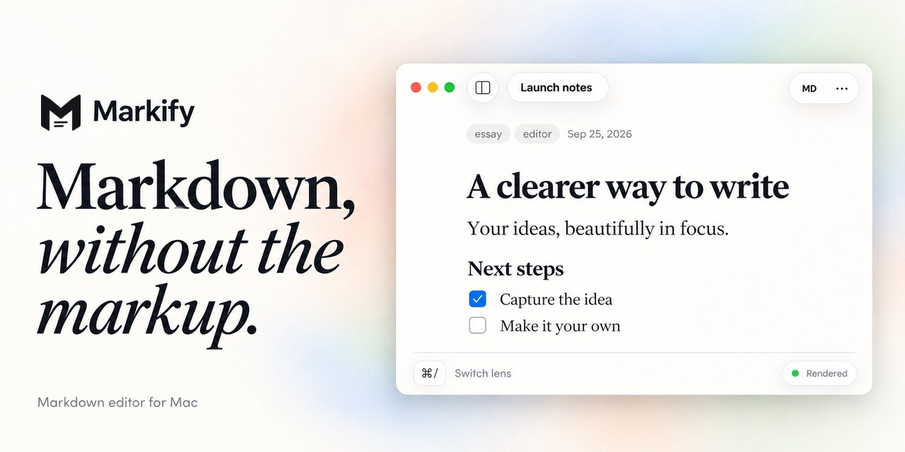
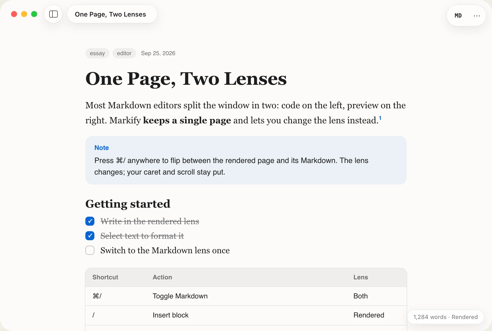
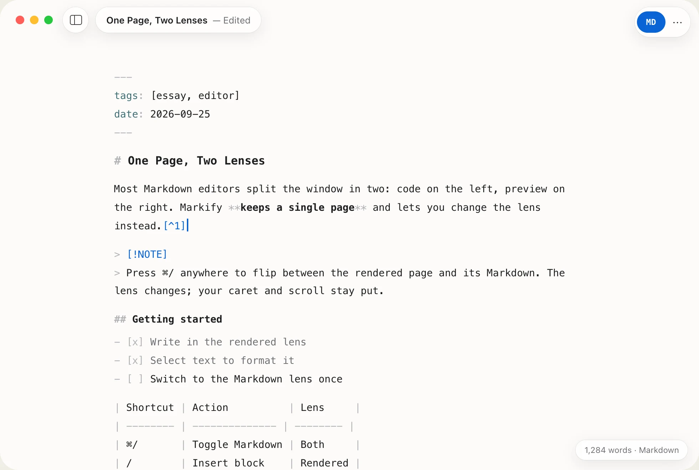
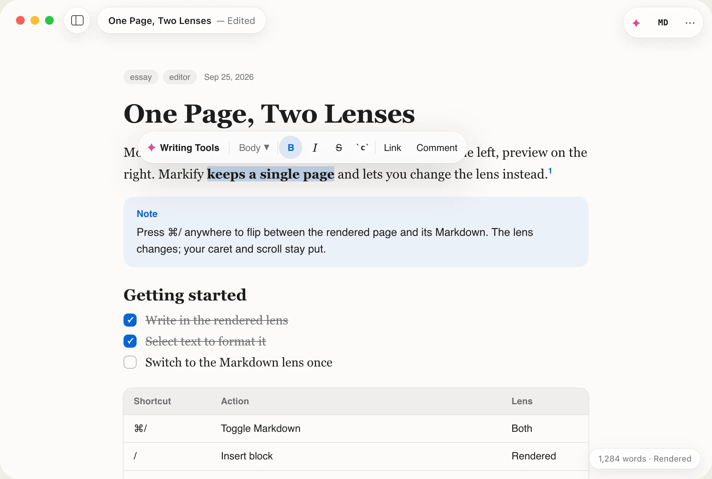
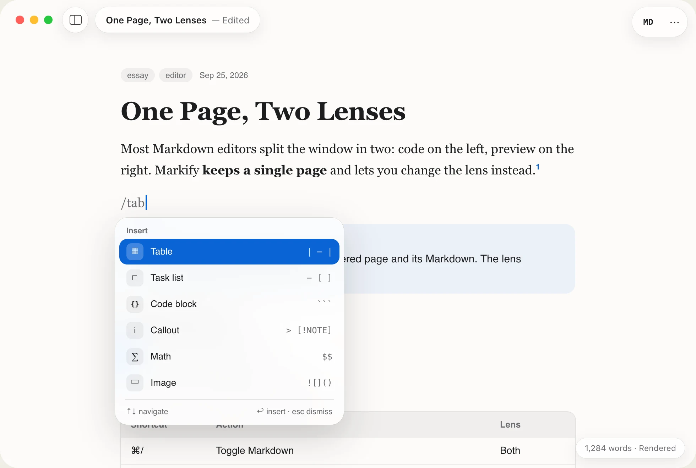
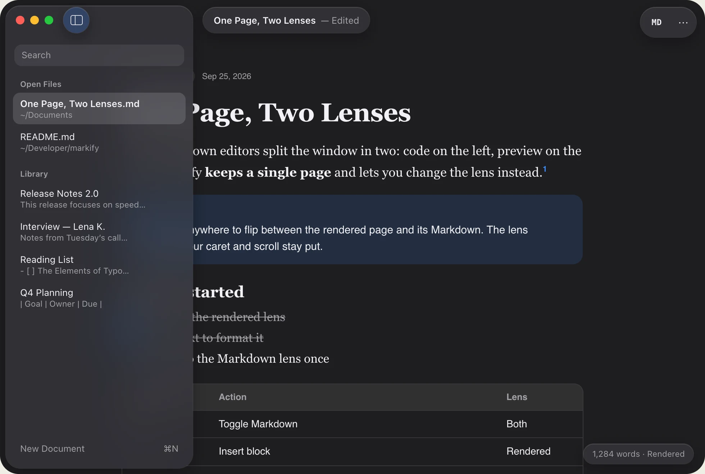
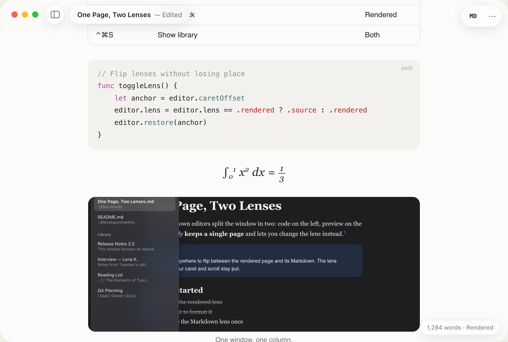
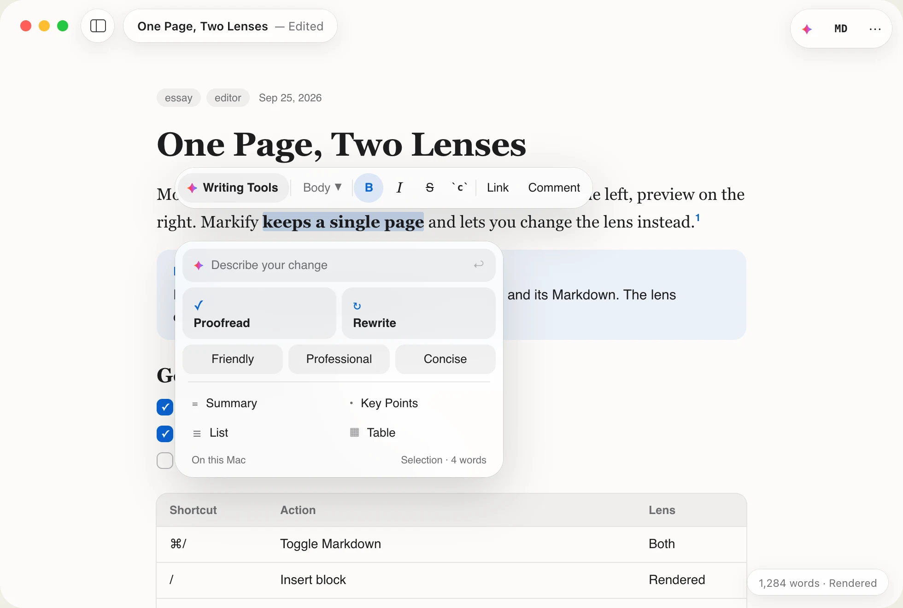
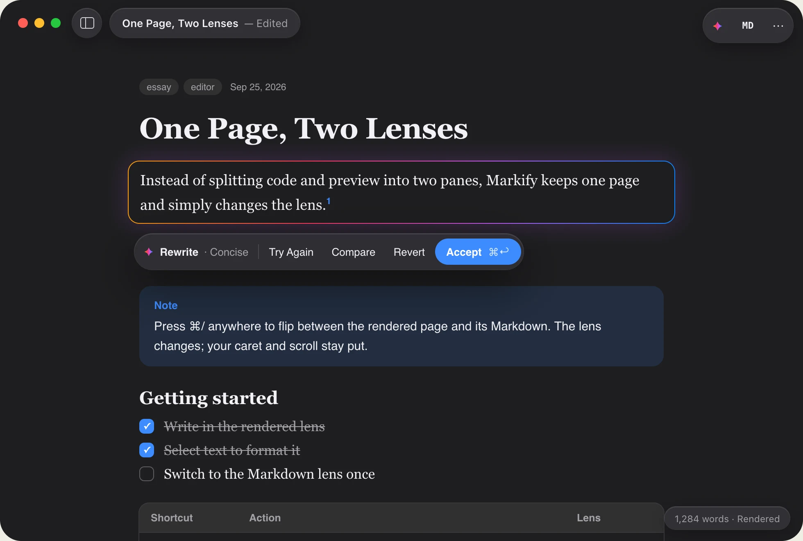

<p align="center">
  <a href="https://spaquet.github.io/markify/"></a>
</p>

<p align="center">
  <a href="https://github.com/spaquet/markify/releases"></a>
  <a href="LICENSE"></a>
  <a href="https://www.apple.com/macos/"></a>
  <a href="https://swift.org"></a>
</p>

#  Markify

A quiet Markdown editor for macOS 26. Write on one rendered page, press <kbd>⌘/</kbd> to see the same text as plain Markdown, and let on-device Apple Intelligence proofread and rewrite. No split preview pane.

**Website:** [spaquet.github.io/markify](https://spaquet.github.io/markify/)

<p align="center">
  
  
</p>
<p align="center"><sub>The same document in the Rendered lens (left) and the Markdown lens (right).</sub></p>

## Features

- **One page, two lenses**: Edit in place with headings, tables, code, math and images rendered. <kbd>⌘/</kbd> crossfades to the Markdown source and keeps your caret and scroll position.
- **Format bar**: Select text to get a floating glass bar for block style, bold, italic, strikethrough, code and links.
- **Slash menu**: Type `/` to insert tables, task lists, code blocks, callouts, math, images, footnotes or frontmatter. Each row shows its Markdown shortcut.
- **GitHub-Flavored Markdown and more**: Tables, task lists, callouts (`> [!NOTE]`), `$…$` / `$$…$$` math, footnotes and YAML frontmatter.
- **Library**: A glass sidebar (<kbd>⌃⌘S</kbd>) lists open files and library notes, including subfolders. Open any notes folder as your library. Search full note contents with Apple Spotlight (<kbd>⇧⌘F</kbd>), scope results to projects and knowledge bundles, and jump to highlighted matches.
- **Focus**: The toolbar fades while you type and comes back when you move the pointer.
- **Apple Intelligence, on-device only**: Writing Tools, proofread, rewrite, generate at the caret (<kbd>⌘↩</kbd>) and whole-document actions. Nothing leaves your Mac.
- **Plain files**: Documents are ordinary `.md` files with system autosave, versions and Recents.
- **Open from the web**: **File › Open URL…** opens Markdown over HTTPS or browses a GitHub or GitLab repository, with token access for private ones.
- **Links panel**: Lists every link destination with its lines, and summarizes local notes or web pages on-device with Apple Intelligence.
- **Command line and coding agents**: The bundled `markify` command opens reports (`view`), validates OKF bundles (`check`) and exports HTML (`export`). Plugins for Claude Code, Codex and OpenCode send agent answers to a Markify window.
- **Finder Quick Look**: Press Space on a Markdown file to preview formatted text, local images, math and diagrams without opening Markify.

See [FEATURES.md](FEATURES.md) for the full implemented feature inventory.

## Screenshots

<table>
  <tr>
    <td width="50%"><br><sub><b>Format bar.</b> Appears on selection and goes away on the next keystroke.</sub></td>
    <td width="50%"><br><sub><b>Slash menu.</b> Insert any block and learn its Markdown syntax.</sub></td>
  </tr>
  <tr>
    <td><br><sub><b>Library.</b> Open files and notes in one sidebar.</sub></td>
    <td><br><sub><b>Rendered blocks.</b> Syntax-colored code, typeset math, images and footnotes.</sub></td>
  </tr>
  <tr>
    <td><br><sub><b>Writing Tools.</b> Proofread, rewrite or change the tone of a selection.</sub></td>
    <td><br><sub><b>Rewrite.</b> Review the change, compare, revert or accept.</sub></td>
  </tr>
</table>

## Download

Get the latest version of Markify from the [Releases page](https://github.com/spaquet/markify/releases).

### Homebrew

Once the cask is merged into the default branch, install from Markify's project-owned tap:

```sh
brew tap spaquet/markify https://github.com/spaquet/markify.git
brew install --cask spaquet/markify/markify
```

Markify is not yet notarized. Homebrew preserves quarantine, so first launch may require approval in **System Settings › Privacy & Security › Open Anyway** if you trust the release. See [Homebrew distribution](HOMEBREW.md) for updates, validation and official-cask eligibility.

### Pre-built Binaries

Two versions are available for download:

- **`markify-as.dmg`** - For Apple Silicon Macs (M1, M2, M3, M4 and newer)
- **`markify-intel.dmg`** - For Intel Macs

Not sure which one to choose? Check your Mac:
- Apple menu → About This Mac → Look at the "Chip" field
- If it says "Apple M1", "M2", "M3", or "M4": Download **Apple Silicon (as)**
- If it says "Intel Core": Download **Intel**

### Installation from DMG

1. Download the appropriate DMG file for your Mac
2. Double-click the DMG file to open it
3. Drag the **Markify** app to your **Applications** folder
4. On first launch, you may see a security warning (since the app is unsigned)
   - Right-click on Markify in Applications folder
   - Select "Open" from the context menu
   - Click "Open" in the security dialog
5. On subsequent launches, you can open Markify normally from Applications or Spotlight

> **Note**: Markify is currently distributed as an unsigned application. You will see a security warning on first launch. This is expected and safe. For more information about unsigned apps, see the [FAQ](#faq).

## Requirements

- **macOS 26 Tahoe** or later
- **Apple Intelligence** features need a Mac that supports it, with Apple Intelligence turned on
- **Xcode 26** or later (for building from source)

## Building from Source

### Installation

1. Clone the repository:
```bash
git clone https://github.com/spaquet/markify.git
cd markify
```

2. Open the Xcode project:
```bash
open Markify.xcodeproj
```

3. Select the "Markify" scheme and press Cmd+R to build and run, or Cmd+B to build.

4. The app will be built to `DerivedData/` and can be installed to `/Applications`:
```bash
open build/Release/Markify.app
```

## Usage

- **Open a file**: <kbd>⌘O</kbd>, or double-click any `.md` file
- **New document**: <kbd>⌘N</kbd>
- **Switch lens**: <kbd>⌘/</kbd> or the **MD** button in the toolbar
- **Insert a block**: type `/` at the start of a line
- **Format**: select text, or use <kbd>⌘B</kbd> <kbd>⌘I</kbd> <kbd>⇧⌘X</kbd> <kbd>⌘E</kbd> <kbd>⌘K</kbd>
- **Library**: <kbd>⌃⌘S</kbd>
- **Writing Tools**: <kbd>⇧⌘W</kbd>, or generate at the caret with <kbd>⌘↩</kbd>

## Development

### Build

```bash
xcodebuild -project Markify.xcodeproj -scheme Markify -configuration Release build
```

### Test

```bash
xcodebuild -project Markify.xcodeproj -scheme Markify test
```

See [AGENTS.md](AGENTS.md) for development notes.

## Architecture

Markify is a SwiftUI document-based app. The Markdown source string is the single source of truth, and both lenses are stylings of the same text.

- **MarkifyApp**: Entry point, `DocumentGroup` and Settings scene
- **MarkifyDocument**: File I/O for `.md` files
- **ContentView**: Window chrome and the floating glass control layer
- **NativeEditor**: TextKit 2 `NSTextView` editor that renders blocks in place
- **Settings/**, **Theme**, **Shortcuts**: Preferences, design tokens and key bindings

See [AGENTS.md](AGENTS.md) for development notes.

## Dependencies

- [swift-markdown](https://github.com/swiftlang/swift-markdown) - Markdown parsing (cmark-gfm)
- [SwaTex](https://github.com/PhraseHQ/SwaTex) - Math rendering
- [Mermaid](https://github.com/mermaid-js/mermaid) 12.0.0 - Diagram rendering, bundled in `Markify/Resources/Mermaid` (MIT, see `mermaid-LICENSE.txt`)

## License

Markify is source available under the MIT License with the Commons Clause condition. See [LICENSE](LICENSE) for the terms.

**In summary:**
- ✅ You may use Markify for personal or work documents
- ✅ You may study, modify and redistribute the source under the license terms
- ❌ You may not sell Markify itself, or a product or service whose value derives substantially from it, without permission

For permission to sell Markify itself, contact the maintainer.

## Contributing

Contributions are welcome, but please note the licensing restrictions. Any contributions will be subject to the same license terms.

## Author

Created by [Stéphane PAQUET](https://github.com/spaquet)

## FAQ

### Why is Markify unsigned?

Markify is currently distributed as an unsigned application without Apple's Developer ID certificate. This means:

- **First launch security warning**: macOS will show a warning dialog asking if you want to open the app
- **Workaround**: Right-click the app and select "Open" - this bypasses the Gatekeeper check
- **Future plans**: As Markify grows, we plan to add code signing and notarization for a cleaner user experience

### Is it safe to use an unsigned app?

Yes, absolutely! The source code is open and available on GitHub. You can review it yourself or build it directly from source. Unsigned just means we haven't purchased an Apple Developer ID certificate yet.

### How do I know which version to download?

Check your Mac's architecture:
1. Click the Apple menu in the top-left
2. Select "About This Mac"
3. Look at the "Chip" field:
   - **Apple M1, M2, M3, M4**: Download `markify-as.dmg` (Apple Silicon)
   - **Intel Core**: Download `markify-intel.dmg` (Intel)

### Can I verify the downloaded file is authentic?

Yes! Each DMG file comes with a SHA256 checksum file (`.sha256`). After downloading:

```bash
# Navigate to your Downloads folder
cd ~/Downloads

# Verify the checksum
shasum -c markify-as.dmg.sha256
# or
shasum -c markify-intel.dmg.sha256
```

You should see `OK` if the file is authentic.

## Support

For bug reports, feature requests, and questions, please use the [GitHub Issues](https://github.com/spaquet/markify/issues) page.
