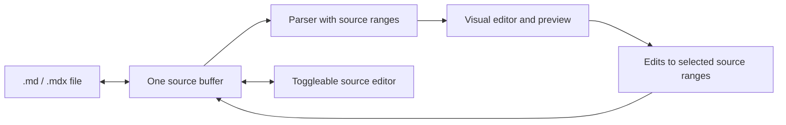

# Source-preserving editor plan

## Agreed scope

- Support macOS 26 and newer.
- Keep a toggleable source editor for Markdown and MDX.
- Provide visual editing while preserving untouched source bytes and unsupported syntax when switching modes.
- Render MDX JSX components using imports from the file's project. Require explicit trust for each project folder before running its code.
- Edit imported components visually through project-supplied schemas that describe editable props and child slots. Keep unsupported expressions accessible in source mode.
- Render LaTeX math inside Markdown and MDX; full `.tex` documents are outside this plan.
- Start AI features with system Writing Tools and Apple's on-device Foundation Models. Cloud models are outside this plan.

The first reference environment for MDX will be a conventional React/MDX project with installed dependencies. This is a test target, not a promise that every framework's build configuration will work immediately.

## Current gaps

| Area | Current behavior | Work needed |
| --- | --- | --- |
| Markdown | `MarkdownPreview` displays MarkdownUI output. | Add visual editing and verify supported syntax with fixtures. |
| MDX | `MarkifyDocument` opens `.mdx` as text, but the preview passes it to the Markdown renderer. | Resolve project imports, render JSX and expressions, and connect components to source ranges. |
| Math | No math parser or renderer is wired in. | Render inline and display math in `.md` and `.mdx`. |
| Editing | `ContentView` uses separate editor text and document content; the preview is read-only. | Use one authoritative current source buffer for editing, preview, save, undo, and mode switching. |
| Saving | Document snapshots read `content`, while typed text first enters `editingContent` and may wait for a debounce. | Reproduce and fix the risk of saving stale content, especially with auto-save disabled. |
| Resources | Image insertion creates relative paths, but `MarkdownPreview` supplies no document base URL. | Resolve local images and links against the document location. |
| AI | No intentional writing or generation integration. | Add prose-scoped actions that protect Markdown, MDX, code, and math syntax. |
| Verification | The unit test is a placeholder. | Add representative round-trip and save tests. |

## Architecture

The source buffer is authoritative. Editing updates it immediately; save policy and preview parsing are separate concerns. Visual operations patch only the source ranges they own. They must not serialize the entire rendered document back to Markdown or MDX. Parse failures and unsupported constructs remain intact and editable in source mode. Preserve undo, selection, and cursor position across modes where the mapping is valid.

Keep the macOS app shell in SwiftUI. Prototype a WebKit visual surface with the project's MDX/React runtime, because imported JSX needs that runtime. Use a native text view for source editing. Only run project code after the user trusts its folder; scope file access and handle failed imports without changing the document. The feasibility prototype must establish reliable source-to-component mapping before the visual editor architecture is fixed.

For JSX, selecting a rendered component should show controls supplied by that project's schema. Those controls patch the corresponding JSX prop or child ranges. Unknown components, unsupported props, and dynamic expressions remain visible and source-editable. The schema format and project integration should be chosen from a working reference project during the prototype.

For math, support inline `$…$` and display `$$…$$` first. A formula is rendered visually and edited as LaTeX source. Treat literal dollar signs and code spans as distinct from math during parsing.

## Delivery order and acceptance gates

1. **Support contract and fixtures.** Collect representative Markdown, GFM, math, and MDX documents. Record which constructs render, edit visually, or require source mode. Include invalid and partially written syntax.
2. **Document state.** Reproduce the stale-save risk. Make every edit visible in the current source buffer and ensure save snapshots use it. Verify save, reopen, undo, and auto-save-off behavior.
3. **Visual Markdown editing.** Start with prose, headings, emphasis, lists, links, and images. Add complex blocks when their source-preserving round trips pass. Keep the source toggle available throughout.
4. **Math.** Render and source-edit inline and display formulas without changing surrounding Markdown or MDX.
5. **Trusted MDX.** Compile and render project imports for the reference React/MDX project after trust. Add schema-driven component controls. Verify successful imports, failed imports, unknown components, dynamic props, and untouched-source preservation.
6. **Apple intelligence.** Use Writing Tools for proofreading and rewriting. Use on-device Foundation Models for explicit generation commands, preview proposed edits before applying them, and check model availability at runtime. Keep core editing functional when Apple Intelligence is unavailable.
7. **macOS 27 enhancements.** Evaluate useful document actions through App Intents and adopt system interface improvements without making the core editor depend on macOS 27.

The first implementation gate is a small prototype proving that a visual Markdown edit and a schema-controlled JSX edit change only their intended source ranges. If that fails, revise the editor architecture before building the full interface.

## References

- [MDX format and imports](https://mdxjs.com/docs/what-is-mdx/) and [MDX compilation and execution](https://mdxjs.com/packages/mdx/)
- [GitHub math syntax](https://docs.github.com/en/get-started/writing-on-github/working-with-advanced-formatting/writing-mathematical-expressions)
- [AppKit Writing Tools](https://developer.apple.com/documentation/appkit/writing-tools) and [WebKit Writing Tools](https://webkit.org/blog/16188/webkit-features-in-safari-18-1/)
- [Foundation Models availability](https://developer.apple.com/documentation/foundationmodels/systemlanguagemodel)
- [Apple's macOS 27 developer guide](https://developer.apple.com/wwdc26/guides/macos/)
