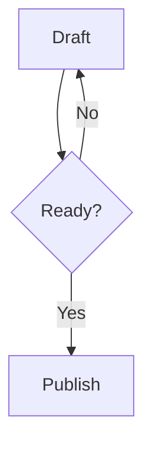
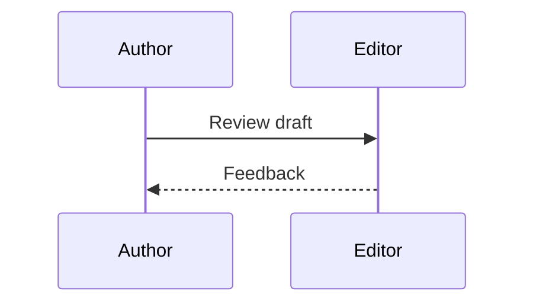

# Markdown support

Markify reads Markdown the way GitHub does: it follows [CommonMark](https://commonmark.org) and [GitHub Flavored Markdown](https://github.github.com/gfm/) (GFM), then adds math, footnotes, callouts, diagrams and frontmatter. It opens `.md`, `.markdown` and `.mdx` files and saves them as plain UTF-8 text, exactly as written.

## Text

| You type | You get |
| --- | --- |
| `**bold**` or `__bold__` | **bold** |
| `*italic*` or `_italic_` | *italic* |
| `~~strikethrough~~` | ~~strikethrough~~ |
| `` `code` `` | `code` |
| `$x^2$` | inline math: x² |
| `[text](https://example.com)` | a link |
| `\*` | a literal asterisk |

## Blocks

- **Headings**: `#` to `######`, or a line underlined with `===` or `---`.
- **Lists**: `-`, `*` or `+` for bullets, `1.` or `1)` for numbers. Indent to nest.
- **Task lists**: `- [ ]` and `- [x]`. Click the box to toggle it.
- **Quotes**: start a line with `>`.
- **Code blocks**: fence with three backticks or tildes, and name the language after the opening fence for syntax colors. Indented code also works. In the Rendered lens, the copy button at the top right of a code block copies its code, without the fences, to the clipboard.
- **Tables**: GFM pipe tables, with `:--`, `:-:` and `--:` in the separator row to align columns.
- **Dividers**: `---`, `***` or `___` on a line of their own.
- **HTML**: HTML blocks, inline images and inline SVG display in the Rendered lens; HTML comments (`<!-- … -->`) are hidden. The Markdown lens shows the original tags, which remain editable.

### HTML and scripts

Markify does not run scripts from a document. The Rendered lens shows the HTML's text, images and tables, and scripts do not run. HTML and PDF exports, and Quick Look, carry a Content-Security-Policy that blocks scripts and event handlers, so an exported file does not run them when you open it. Markify does not filter HTML by an allowlist of tags or attributes, so the exported page keeps the HTML as written, just without running it. Remote images load only when **Load remote images** is on in Settings; it is on by default, and the exported page allows remote images only when it is on.

## Callouts

GitHub-style alerts render as colored boxes:

```markdown
> [!NOTE]
> Useful information.
```

The types are `NOTE`, `TIP`, `IMPORTANT` and `WARNING`.

## Math

Write LaTeX between dollar signs. Single dollars set math inline, in the flow of the sentence; `$$` on lines of their own sets a display equation:

```markdown
Euler's identity, $e^{i\pi}+1=0$, links five constants.

$$
\int_0^1 x^2\,dx = \frac{1}{3}
$$
```

In the Rendered lens, math is typeset in place: `$E = mc^2$` shows as a formula with a real superscript. Click a formula or move the caret into it to edit its LaTeX; it's typeset again when you leave it. A dollar amount such as “$5 and $10” stays text: inline math needs no space inside the dollars and no digit right after the closing one. Math is typeset on your Mac, without a network connection.

## Footnotes

Write `[^1]` where the note belongs and `[^1]: The note.` anywhere in the document. Hover over a reference to read its note; ⌘-click to jump to the note and back.

## Mermaid diagrams

A fenced block with the language `mermaid` renders as a diagram in the Rendered lens. Use `mermaid` on the opening fence for every diagram type; the first line inside chooses the type. For a flowchart:

````markdown

````

For a sequence diagram, use the same fence and start with `sequenceDiagram`:

````markdown

````

Flowcharts also accept `graph TD` or `graph LR`; `TD` runs from top to bottom and `LR` from left to right. Flowcharts support decision shapes, labeled arrows and subgraphs. Sequence diagrams support participants, messages, notes, activation, loops and alternatives. A fence labeled `flowchart` or `sequence` is an ordinary code block: those names do not replace `mermaid`.

The bundled Mermaid 12 engine also handles class (`classDiagram`), state (`stateDiagram-v2`), entity relationship (`erDiagram`), Gantt (`gantt`), pie (`pie`), journey (`journey`), Git (`gitGraph`), mind map (`mindmap`), timeline (`timeline`), quadrant (`quadrantChart`), XY (`xychart-beta`), block (`block-beta`) and Sankey (`sankey-beta`) diagrams. See Mermaid's [flowchart syntax](https://mermaid.js.org/syntax/flowchart.html) and [sequence syntax](https://mermaid.js.org/syntax/sequenceDiagram.html) for details. Syntax from a newer Mermaid release may require a future Markify update.

Requirements (`requirementDiagram`), packets (`packet-beta`), architecture (`architecture-beta`), Kanban (`kanban`) and C4 (`C4Context`) are supported too. Mermaid YAML frontmatter inside the fence can set a diagram title and configuration; it is separate from the document's frontmatter.

Choose **Mermaid** in the `/` menu to insert a starter flowchart. Switch to the Markdown lens (⌘/) to edit the source; the Rendered lens shows the diagram again. Diagrams follow the light or dark appearance and scale to the column. HTML and PDF exports include vector diagrams, and Finder's Quick Look preview renders them too.

If Mermaid can't read the diagram, Markify shows the source with Mermaid's error message. A failed diagram stays as code in exports. Diagrams render offline with a copy of Mermaid bundled in the app; external images and clickable links inside diagrams are disabled. Each diagram is limited to 64 KB of source and a 15-second rendering timeout; editor images also have size and memory limits.

## Frontmatter

A YAML block at the very top of the file, between `---` lines, holds metadata. Markify shows `tags` and `date` as chips above the title and uses `title` to name an untitled document:

```markdown
---
title: Field notes
tags: [travel, draft]
date: 2026-09-25
---
```

## MDX

In `.mdx` files, `import` and `export` lines and JSX blocks such as `<Chart />` are dimmed and kept exactly as written. Everything else is Markdown.
