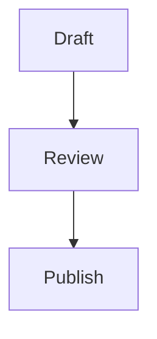

# Markdown support

Markify reads Markdown the way GitHub does: it follows [CommonMark](https://commonmark.org) and [GitHub Flavored Markdown](https://github.github.com/gfm/) (GFM), then adds math, footnotes, callouts, diagrams and frontmatter. It opens `.md`, `.markdown` and `.mdx` files and saves them as plain UTF-8 text, exactly as written.

## Text

| You type | You get |
| --- | --- |
| `**bold**` or `__bold__` | **bold** |
| `*italic*` or `_italic_` | *italic* |
| `~~strikethrough~~` | ~~strikethrough~~ |
| `` `code` `` | `code` |
| `[text](https://example.com)` | a link |
| `\*` | a literal asterisk |

## Blocks

- **Headings**: `#` to `######`, or a line underlined with `===` or `---`.
- **Lists**: `-`, `*` or `+` for bullets, `1.` or `1)` for numbers. Indent to nest.
- **Task lists**: `- [ ]` and `- [x]`. Click the box to toggle it.
- **Quotes**: start a line with `>`.
- **Code blocks**: fence with three backticks or tildes, and name the language after the opening fence for syntax colors. Indented code also works.
- **Tables**: GFM pipe tables, with `:--`, `:-:` and `--:` in the separator row to align columns.
- **Dividers**: `---`, `***` or `___` on a line of their own.
- **HTML**: HTML blocks and inline tags are kept as written.

## Callouts

GitHub-style alerts render as colored boxes:

```markdown
> [!NOTE]
> Useful information.
```

The types are `NOTE`, `TIP`, `IMPORTANT` and `WARNING`.

## Math

Write LaTeX between dollar signs. `$e^{i\pi}+1=0$` sets math inline; `$$` on lines of their own sets a display equation:

```markdown
$$
\int_0^1 x^2\,dx = \frac{1}{3}
$$
```

In the Rendered lens, math is typeset in place: `$E = mc^2$` shows as a formula with a real superscript. Click a formula or move the caret into it to edit its LaTeX; it's typeset again when you leave it. A dollar amount such as “$5 and $10” stays text: inline math needs no space inside the dollars and no digit right after the closing one. Math is typeset on your Mac, without a network connection.

## Footnotes

Write `[^1]` where the note belongs and `[^1]: The note.` anywhere in the document. Hover over a reference to read its note; ⌘-click to jump to the note and back.

## Mermaid diagrams

A fenced block with the language `mermaid` renders as a diagram in the Rendered lens:

````markdown

````

If Mermaid can't read the diagram, Markify shows the source with Mermaid's error message. Diagrams render offline with a copy of Mermaid bundled in the app.

## Frontmatter

A YAML block at the very top of the file, between `---` lines, holds metadata. Markify shows `tags` and `date` as chips above the title and uses `title` to name an untitled document:

```markdown
---
title: Field notes
tags: [travel, draft]
date: 2026-09-25
---
```

## MDX

In `.mdx` files, `import` and `export` lines and JSX blocks such as `<Chart />` are dimmed and kept exactly as written. Everything else is Markdown.
