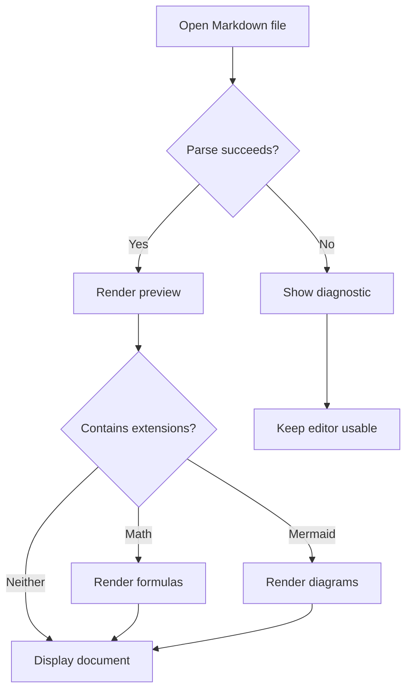
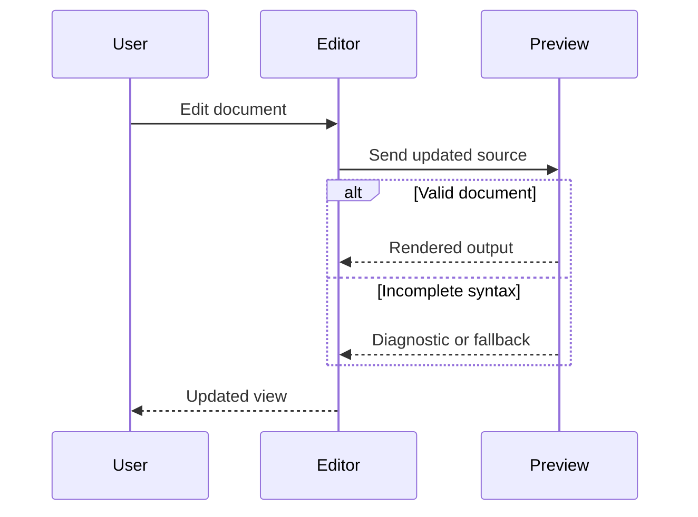
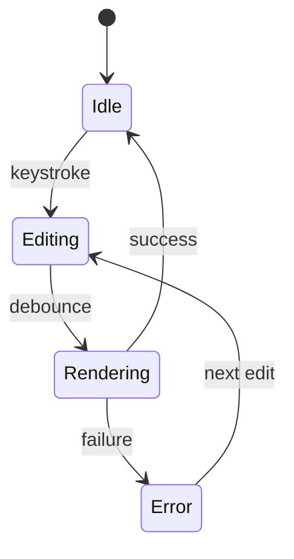
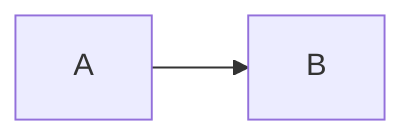

# Mixed Markdown Test

This paragraph contains **bold**, *italic*, ~~strikethrough~~,
`inline code`, and a [reference link][docs].

Bare URL: https://example.com

Escaped delimiters: \*not emphasis\* and \_not emphasis\_.

## Tasks and nesting

- [x] Parse Markdown
- [ ] Render extensions
  - [x] Tables
  - [ ] Math
  - [ ] Mermaid
- [ ] Preserve source during editing

1. First item

   A second paragraph inside the first item.

   > A blockquote inside the list.
   >
   > - A nested bullet
   > - Another nested bullet

2. Second item

## GFM table

| Feature | Example | Status |
| :--- | :---: | ---: |
| Inline code | `a \| b` | Pass |
| Emphasis | **strong** and *soft* | Pass |
| Inline math | $a^2 + b^2 = c^2$ | Pending |
| HTML | <kbd>Ctrl</kbd> + <kbd>S</kbd> | Pending |

## Inline and display math

Inline math: $E = mc^2$.

Currency controls: $5.00, $10.00, and \$20.00.

$$
\begin{aligned}
f(x) &= \int_0^x t^2\,dt \\
     &= \frac{x^3}{3}
\end{aligned}
$$

$$
A =
\begin{pmatrix}
1 & 2 \\
3 & 4
\end{pmatrix}
\qquad
\sum_{k=1}^{n} k = \frac{n(n+1)}{2}
$$

The following code must remain literal:

```text
$not_math$
$$also_not_math$$
<details>not HTML here</details>
```

## Mermaid flowchart



## Mermaid sequence diagram



## Mermaid state diagram



## Inline HTML

Press <kbd>Ctrl</kbd> + <kbd>S</kbd>.

Water: H<sub>2</sub>O. Squared: x<sup>2</sup>.

A line break:<br>
This follows the HTML break.

<details>
<summary>Expand this mixed-content section</summary>

### Markdown inside details

- **Bold list item**
- Inline formula: $x + y = z$
- [ ] A nested task

```javascript
const literal = "<div>$not_math$</div>";
console.log(literal);
```

</details>

## Raw HTML block

<div>
<p>This paragraph is HTML, with <em>HTML emphasis</em>.</p>
<p>**This is a Markdown-boundary probe, not an assertion.**</p>
</div>

## HTML table

<table>
  <thead>
    <tr><th>Item</th><th>Value</th></tr>
  </thead>
  <tbody>
    <tr><td>Subscript</td><td>H<sub>2</sub>O</td></tr>
    <tr><td>Keyboard</td><td><kbd>Enter</kbd></td></tr>
  </tbody>
</table>

## Fence nesting

The outer fence should contain the inner fence literally:

````text

````

## Unicode and escaping

French: été, façade, cœur.
Greek: α β γ.
Japanese: 日本語.
Emoji: 🧪 ✅ 🚀.

Entities: &amp; &lt; &gt; &quot;.

Literal HTML: \<div\>not a tag\</div\>.

## Reference definitions

[docs]: https://example.com/docs "Example documentation"